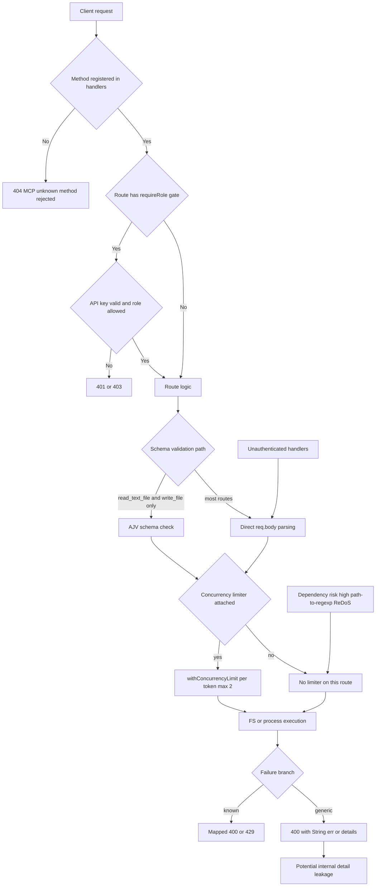

# Q5 Agent Report: MRT Arsenal Production Readiness Security Audit
Date: 2026-04-05
Scope: mcp_server/src/server.ts, mcp_server/tests/stdio_proxy_test.js, tests/rwfi2_mrt_contract_tests.rs, docs/consumer-contracts.md

## 1) Production Ready Verdict
- Production ready: NO
- Overall security gate: BLOCKED

Primary blockers:
1. Auth hardening is partial. MRT routes are gated, but multiple exposed handlers are unauthenticated.
2. Input validation is not present on every exposed tool.
3. Rate limiting is only applied to selected execution paths.
4. Test coverage does not include all exposed tools and Rust tests are mostly source string canaries.
5. Dependency audit reports one high severity and one moderate severity vulnerability.

## 2) Evidence Table
| Dimension | Evidence with exact path and line | Assessment |
|---|---|---|
| Auth hardening baseline exists for MRT dispatch | mcp_server/src/server.ts:31, mcp_server/src/server.ts:44-53, mcp_server/src/server.ts:226-230, mcp_server/src/server.ts:964-993 | Role gating exists for mrt_* routes. |
| API key hashing and verification are implemented | mcp_server/src/server.ts:622-664, mcp_server/src/server.ts:868-887, mcp_server/src/server.ts:901-936 | Good baseline for key storage and verification. |
| Unauthenticated exposed handlers remain | mcp_server/src/server.ts:462, mcp_server/src/server.ts:856, mcp_server/src/server.ts:862, mcp_server/src/server.ts:1018, mcp_server/src/server.ts:1127, mcp_server/src/server.ts:1161, mcp_server/src/server.ts:1174, mcp_server/src/server.ts:1225, mcp_server/src/server.ts:1281, mcp_server/src/server.ts:1301 and requireRole call sites only at mcp_server/src/server.ts:31, mcp_server/src/server.ts:59, mcp_server/src/server.ts:869, mcp_server/src/server.ts:891, mcp_server/src/server.ts:902, mcp_server/src/server.ts:1036, mcp_server/src/server.ts:1193, mcp_server/src/server.ts:1250 | Exposed read and EDA style routes can be called without role checks. |
| Input schema validation is narrow | mcp_server/src/server.ts:324-346, mcp_server/src/server.ts:355-366, mcp_server/src/server.ts:1018, mcp_server/src/server.ts:1033 | AJV schema validation only covers read_text_file and write_file. |
| Many routes parse req.body directly without AJV | mcp_server/src/server.ts:875, mcp_server/src/server.ts:908, mcp_server/src/server.ts:1129, mcp_server/src/server.ts:1163, mcp_server/src/server.ts:1176, mcp_server/src/server.ts:1198, mcp_server/src/server.ts:1227, mcp_server/src/server.ts:1255, mcp_server/src/server.ts:1283, mcp_server/src/server.ts:1303 | Validation depth is inconsistent across tools. |
| Rate limiting exists but is partial | mcp_server/src/server.ts:672, mcp_server/src/server.ts:819-833, mcp_server/src/server.ts:235, mcp_server/src/server.ts:947, mcp_server/src/server.ts:1203, mcp_server/src/server.ts:1263 | withConcurrencyLimit is not applied to all exposed handlers. |
| Graceful failure paths exist | mcp_server/src/server.ts:255-291, mcp_server/src/server.ts:953-955, mcp_server/src/server.ts:1211-1212, mcp_server/src/server.ts:1269-1270, mcp_server/src/server.ts:1331-1333 | Several common failures map cleanly to 400, 429, and 503. |
| Error detail leakage risk | mcp_server/src/server.ts:34, mcp_server/src/server.ts:290-291, mcp_server/src/server.ts:1028, mcp_server/src/server.ts:1122, mcp_server/src/server.ts:1142, mcp_server/src/server.ts:1169, mcp_server/src/server.ts:1184, mcp_server/src/server.ts:1217, mcp_server/src/server.ts:1241, mcp_server/src/server.ts:1275, mcp_server/src/server.ts:1295, mcp_server/src/server.ts:1321 | Raw error strings and details may leak internal context. |
| Schema contract mismatch | mcp_server/src/server.ts:484, mcp_server/src/server.ts:493, mcp_server/src/server.ts:503, mcp_server/src/server.ts:519, mcp_server/src/server.ts:536, mcp_server/src/server.ts:541 versus implemented route inventory at mcp_server/src/server.ts:856-1301 | mcp_schema advertises methods that have no handlers. |
| Documentation contract requirement | docs/consumer-contracts.md:15 | mcp_server contract requires explicit typed allowlisted stable routing. |
| JS integration test coverage has useful MRT checks | mcp_server/tests/stdio_proxy_test.js:150-154, mcp_server/tests/stdio_proxy_test.js:156-167, mcp_server/tests/stdio_proxy_test.js:195-208, mcp_server/tests/stdio_proxy_test.js:227-236, mcp_server/tests/stdio_proxy_test.js:241-319, mcp_server/tests/stdio_proxy_test.js:329-345 | Good baseline for key MRT and core flows. |
| JS integration test coverage gaps | mcp_server/tests/stdio_proxy_test.js:1-376 has no references to list_directory_with_sizes, move_file, get_file_info, list_allowed_directories, read_netlist, run_simulator, estimate_resources, parity_check | Not all exposed handlers are covered. |
| Rust contract tests are source canaries, not runtime behavior tests | tests/rwfi2_mrt_contract_tests.rs:8-23, tests/rwfi2_mrt_contract_tests.rs:29-114 | Structural checks are present, runtime failure path coverage is limited. |
| Rust contract suite run result | tests/rwfi2_mrt_contract_tests.rs executed on 2026-04-05 via cargo.exe test --test rwfi2_mrt_contract_tests, result: 11 passed | Targeted Rust contract suite is green. |
| Dependency audit result | npm audit --prefix mcp_server --omit=dev --json on 2026-04-05 found high path-to-regexp GHSA-37ch-88jc-xwx2 and moderate brace-expansion GHSA-f886-m6hf-6m8v | Current dependency state is not production ready. |

## 3) Dimension Rating Table
| Dimension | Rating | Status | Notes |
|---|---|---|---|
| Auth hardening | 2/5 | NEEDS_FIXES | Strong MRT route gating, but many exposed handlers remain unauthenticated. |
| Error handling completeness | 3/5 | PARTIAL | Many try catch paths exist, but error payloads expose internals and status mapping is inconsistent. |
| Test coverage of all exposed tools | 2/5 | NEEDS_FIXES | MRT paths are tested, but several exposed handlers are not covered and Rust checks are mostly source text assertions. |
| Rate limiting | 2/5 | NEEDS_FIXES | Token based limiter exists but only for a subset of handlers. |
| Input validation on every tool | 2/5 | NEEDS_FIXES | AJV covers only two tools; many handlers accept body fields without schema checks. |
| Graceful failure modes | 3/5 | PARTIAL | Unknown methods fail closed by default and overload path exists, but detail leakage remains. |

## 4) Threat and Failure Flow Diagram

## 5) Hardening Implementation Sketch in Priority Order
1. P0 Enforce default deny authentication across all exposed handlers.
   - Create one route to role policy map covering every handler in server.ts.
   - Require explicit allowlist entry before dispatch and fail closed on missing policy.
2. P0 Add AJV schemas for every handler request body and enforce additionalProperties false.
   - Add schemas for generate_api_key, revoke_api_key, list_directory, directory_tree, search_files, run_cargo, read_netlist, run_simulator, estimate_resources, parity_check, and mrt_execute compatibility wrapper.
3. P0 Apply rate limiting consistently to all IO or CPU heavy handlers.
   - Extend withConcurrencyLimit usage beyond MRT, run_cargo, run_simulator, and long_running.
   - Add anonymous caller global limits and bounded request body size checks per route.
4. P0 Resolve schema and route surface mismatch.
   - Either implement edit_file, create_directory, list_directory_with_sizes, move_file, get_file_info, list_allowed_directories or remove them from mcp_schema until implemented.
5. P0 Sanitize error responses and logs.
   - Return stable error codes and correlation ids to clients.
   - Keep raw stderr stdout and header dumps only in protected server logs.
6. P0 Patch dependency vulnerabilities from npm audit.
   - Upgrade dependency chain to remediate GHSA-37ch-88jc-xwx2 and GHSA-f886-m6hf-6m8v.
7. P1 Expand behavioral test coverage to every exposed handler.
   - Add positive and negative tests for auth, validation, and rate limiting.
   - Add runtime tests for read_netlist, run_simulator, estimate_resources, parity_check, and every schema method.
8. P1 Strengthen Rust contract tests with runtime black box checks.
   - Keep source canaries but add process level assertions for failure mapping and bounds.
9. P2 Add operational guardrails.
   - Add security telemetry for 401, 403, 429, validation failures, and unknown method spikes.
   - Add release gate requiring zero high vulnerabilities from dependency audit.

## 6) Security Review Conclusion
- Production ready for MRT toolchain: NO.
- Merge recommendation: BLOCKED until P0 items are complete.
READY FOR ORCHESTRATOR
