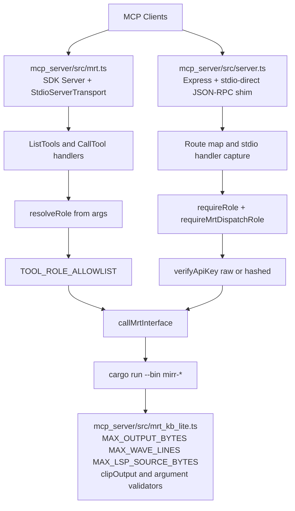

# Q6 Agent Report - MRT Arsenal Architecture Audit

Date: 2026-04-05
Scope files:
- mcp_server/src/server.ts
- mcp_server/src/mrt.ts
- mcp_server/src/mrt_kb_lite.ts
- mcp_server/package.json

## 1) Cutting-Edge-by-2026 Verdict
NO.

The MRT stack is operationally strong on bounded execution and practical role gating, but it is not cutting edge for 2026 MCP server expectations because transport is stdio-centric, tool contract strictness is incomplete, and one runtime path still wraps structured data as text JSON.

## 2) Evidence Table (Exact Paths + Lines)

| Topic | Evidence |
|---|---|
| MCP SDK dependency present | mcp_server/package.json:14 |
| SDK server path uses stdio transport | mcp_server/src/mrt.ts:2, mcp_server/src/mrt.ts:375, mcp_server/src/mrt.ts:377 |
| Alternate active runtime is stdio-direct | mcp_server/src/server.ts:682, mcp_server/src/server.ts:1325, mcp_server/src/server.ts:1327 |
| No SSE or streamable HTTP implementation in scoped files | mcp_server/src/mrt.ts:2, mcp_server/src/mrt.ts:375, mcp_server/src/server.ts:682, mcp_server/src/server.ts:1327 |
| Tool schemas declared per MRT tool | mcp_server/src/mrt.ts:49, mcp_server/src/mrt.ts:60, mcp_server/src/mrt.ts:71, mcp_server/src/mrt.ts:79, mcp_server/src/mrt.ts:87, mcp_server/src/mrt.ts:95, mcp_server/src/mrt.ts:110, mcp_server/src/mrt.ts:125 |
| Required fields only explicitly declared for one tool | mcp_server/src/mrt.ts:65 |
| Runtime role is parsed from call arguments, not server-auth context | mcp_server/src/mrt.ts:276, mcp_server/src/mrt.ts:277 |
| Role allowlist enforcement exists | mcp_server/src/mrt.ts:146, mcp_server/src/mrt.ts:153, mcp_server/src/mrt.ts:288 |
| Server-side API key extraction and bearer support | mcp_server/src/server.ts:26, mcp_server/src/server.ts:28 |
| Server-side key verification with hashed token support | mcp_server/src/server.ts:624, mcp_server/src/server.ts:639, mcp_server/src/server.ts:656 |
| Per-tool role enforcement in server runtime | mcp_server/src/server.ts:44, mcp_server/src/server.ts:45, mcp_server/src/server.ts:55, mcp_server/src/server.ts:59 |
| Bounded output size and clipping constants | mcp_server/src/mrt_kb_lite.ts:3, mcp_server/src/mrt_kb_lite.ts:95 |
| Bounded proposal and LSP input contracts | mcp_server/src/mrt_kb_lite.ts:4, mcp_server/src/mrt_kb_lite.ts:5, mcp_server/src/mrt_kb_lite.ts:59, mcp_server/src/mrt_kb_lite.ts:149, mcp_server/src/mrt_kb_lite.ts:156 |
| Runtime max buffer and timeout bounds for MRT execution | mcp_server/src/mrt.ts:181, mcp_server/src/mrt.ts:182, mcp_server/src/server.ts:184, mcp_server/src/server.ts:216, mcp_server/src/server.ts:673 |
| Concurrency limit enforcement | mcp_server/src/server.ts:672, mcp_server/src/server.ts:826 |
| Structured envelope exists in server JSON response | mcp_server/src/server.ts:244, mcp_server/src/server.ts:250, mcp_server/src/server.ts:252 |
| SDK path returns JSON serialized into text content blocks | mcp_server/src/mrt.ts:229, mcp_server/src/mrt.ts:310, mcp_server/src/mrt.ts:360 |

## 3) Comparison vs 2026 MCP Baseline

| Baseline Dimension | 2026 Baseline Expectation | Current MRT State | Verdict |
|---|---|---|---|
| Stdio vs SSE transport | Stdio for local use plus streamable HTTP/SSE for remote multi-agent and resumable sessions | Two stdio variants exist (SDK stdio and stdio-direct), no streamable/SSE transport path in scope | NO |
| Tool schema completeness | Strict per-tool schemas with required fields, closed object shape, and runtime/auth alignment | inputSchema exists, but required coverage is sparse and runtime role requirement is enforced outside declarative schema | PARTIAL |
| Bounded I/O contracts | Hard bounds on bytes, payload size, source size, timeouts, and concurrency with deterministic clipping/failure metadata | Strong and explicit bounds exist in shared contract module and both runtime paths | YES |
| Role-based access control | Server-asserted principal identity, tamper-resistant role claim, consistent gate across transport paths | server.ts path is strong with token verification; mrt.ts path trusts role from args then allowlist checks | PARTIAL |
| Structured output | Native machine-readable structured payloads in MCP response content | server.ts path returns structured JSON; mrt.ts SDK path returns text blocks containing JSON strings | PARTIAL |
| Agent-optimized response format | Stable typed summary fields and low-friction action extraction for orchestrators | Has useful truncation metadata, but lacks unified typed summary contract across both surfaces | PARTIAL |

## 4) Architecture Topology (Mermaid)

## 5) Implementation-First Modernization Sketch

1. Add first-class streamable HTTP or SSE transport in the canonical runtime surface.
- Keep stdio for local IDE workflows.
- Add explicit runtime transport mode selection and transport health probes.

2. Introduce one shared tool contract module used by both runtime surfaces.
- Declare required fields for all MRT tools.
- Set additionalProperties to false for strict contract behavior.
- Co-locate runtime validation and schema generation to prevent drift.

3. Remove client-asserted role trust from SDK path.
- Replace resolveRole argument parsing with server-asserted identity.
- Reuse the same API-key verification primitive used in server.ts.

4. Return native structured MCP content from SDK path.
- Replace text JSON wrapping with typed content objects.
- Preserve schema_version, output_limit_bytes, stdout_truncated, stderr_truncated as first-class fields.

5. Choose one canonical server surface and demote the other to compatibility mode only.
- If both are retained, they must share contract and auth modules.
- Add parity tests so response shape and RBAC behavior remain aligned.

6. Add 2026 readiness contract tests.
- Transport matrix tests: stdio plus streamable HTTP/SSE.
- Schema strictness tests: required fields and additionalProperties behavior.
- RBAC anti-spoof tests: role cannot be escalated via payload arguments.
- Structured output tests: typed summary fields are stable and machine-consumable.

## Final Answer
Is the MRT toolchain architecture cutting edge by 2026 MCP server standards? NO.

READY FOR ORCHESTRATOR.
