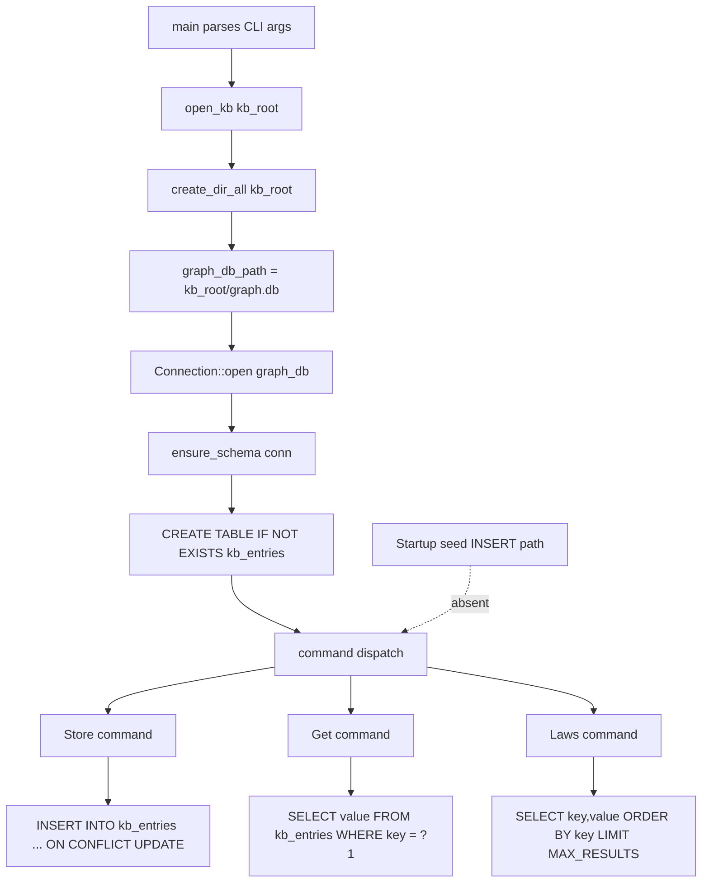

# Q8 Agent Report - MRT Arsenal Dependency and KB Audit
Date: 2026-04-05
Scope: Cargo.toml, Cargo.lock, mcp_server/package.json, src/bin/mirr-brain.rs

## 1) Explicit Verdicts (YES/NO)

- rusqlite with bundled feature installed and lock-resolved: YES.
  - Bundled feature declared in manifest: Cargo.toml:21.
  - rusqlite lock entry present: Cargo.lock:1331 (version 0.32.1).
  - sqlite sys layer lock entry present: Cargo.lock:930 (libsqlite3-sys 0.30.1).
  - Root package includes rusqlite in dependency set: Cargo.lock:1039.

- SQLite KB initialized with seed data on startup: NO.
  - Startup path creates schema only: src/bin/mirr-brain.rs:102-109.
  - Data insertion is command-driven only under Store: src/bin/mirr-brain.rs:142-151.

- SQLite KB starts empty (schema exists, rows absent until Store): YES.
  - DB file opened/created at graph.db during startup: src/bin/mirr-brain.rs:116-119,125.
  - No startup INSERT path exists outside Store branch.

- All declared MRT dependencies are actively used with clear ownership and mature fit: NO.
  - Rust top-level dependencies are all evidenced as used (runtime, dev, tests, or target-specific).
  - Node top-level set has one likely dead-weight item (ajv-formats) and one split-surface ownership risk (@modelcontextprotocol/sdk in mrt.ts while runtime startup targets server.ts).

## 2) Evidence Table (Exact Paths and Lines)

| Topic | Evidence | What it proves |
|---|---|---|
| rusqlite bundled declaration | Cargo.toml:21 | Bundled sqlite feature is explicitly enabled. |
| rusqlite lock entry | Cargo.lock:1331 | rusqlite is resolved in lockfile at 0.32.1. |
| sqlite sys lock entry | Cargo.lock:930 | SQLite C layer is resolved via libsqlite3-sys 0.30.1. |
| root crate includes rusqlite | Cargo.lock:1029-1043 (rusqlite at 1039) | rusqlite is in root dependency closure. |
| kb root + backend constants | src/bin/mirr-brain.rs:37-38 | SQLite KB backend naming is fixed and explicit. |
| schema creation | src/bin/mirr-brain.rs:102-109 | Startup ensures table exists, no seed rows inserted here. |
| db path and open | src/bin/mirr-brain.rs:116-118 | graph.db is created/opened at startup. |
| startup open path | src/bin/mirr-brain.rs:125 | main always calls open_kb before command dispatch. |
| only insert path | src/bin/mirr-brain.rs:142-151 | Writes occur only in Store command. |
| get path | src/bin/mirr-brain.rs:154-168 | Reads are key-based and do not seed data. |
| laws path | src/bin/mirr-brain.rs:171-186 | Listing reads existing rows only. |
| MCP runtime startup target | mcp_server/package.json:5,8; mcp_server/start.js:22,54 | Canonical startup resolves to dist/server.js path. |
| SDK dependency declaration | mcp_server/package.json:14 | MCP SDK is declared dependency. |
| SDK usage location | mcp_server/src/mrt.ts:1-7 | SDK is used in mrt.ts implementation. |
| Express stack usage | mcp_server/src/server.ts:1-2,317 | Express/body-parser runtime stack is active in server.ts. |
| AJV validator usage | mcp_server/src/server.ts:321-352 | AJV is actively used for request validation. |
| glob runtime usage | mcp_server/src/server.ts:7,22,1180 | glob is actively used for search tool behavior. |
| ajv-formats declaration only | mcp_server/package.json:16; mcp_server/package-lock.json:656-658 | Declared and lock-resolved, but no source usage hit in mcp_server/src/server.ts or mcp_server/src/mrt.ts. |
| Node typing and TS toolchain | mcp_server/package.json:9,22-26; mcp_server/tsconfig.json:25; mcp_server/src/server.ts:3-6 | Dev typing and TS build stack are active. |

## 3) Dependency Maturity Table

### 3.1 Rust Stack (Cargo.toml plus Cargo.lock)

| Name | Version (declared -> locked) | MRT usage evidence | Active or dead weight | Maturity level |
|---|---|---|---|---|
| anyhow | 1.0.102 -> 1.0.102 | Cargo.toml:15; Cargo.lock:98; src/bin/mirr-brain.rs:102,114,122 | Active | Mature stable 1.x |
| clap | 4.4.0 -> 4.5.60 | Cargo.toml:16; Cargo.lock:224; src/bin/mirr-brain.rs:28; src/bin/mirr-audit.rs:26 | Active | Mature stable 4.x |
| ed25519-dalek | 2.1.1 -> 2.2.0 | Cargo.toml:17; Cargo.lock:464; src/util/crypto.rs:8; crates/lra-cli/src/keygen.rs:3 | Active | Mature crypto library |
| glob | 0.3.3 -> 0.3.3 | Cargo.toml:18; Cargo.lock:612; src/bin/mirr-audit.rs:28 | Active | Mature utility crate |
| rand | 0.8 -> 0.8.5 | Cargo.toml:19; Cargo.lock:1229; src/util/crypto.rs:9; crates/lra-cli/src/keygen.rs:9 | Active | Mature stable 0.8 line |
| regex | 1.12.3 -> 1.12.3 | Cargo.toml:20; Cargo.lock:1288; src/bin/mirr-audit.rs:29 | Active | Mature stable 1.x |
| rusqlite (bundled) | 0.32 -> 0.32.1 | Cargo.toml:21; Cargo.lock:1331; src/bin/mirr-brain.rs:30 | Active | Mature production sqlite binding |
| libsqlite3-sys (transitive) | transitive -> 0.30.1 | Cargo.lock:930; Cargo.lock:1340 | Active (rusqlite backend) | Mature low-level binding |
| serde | 1.0 -> 1.0.228 | Cargo.toml:22; Cargo.lock:1423; src/bin/mirr-brain.rs:31 | Active | Mature stable 1.x |
| serde_json | 1.0 -> 1.0.149 | Cargo.toml:23; Cargo.lock:1453; src/bin/mirr-brain.rs:198 | Active | Mature stable 1.x |
| sha2 | 0.10 -> 0.10.9 | Cargo.toml:24; Cargo.lock:1466; src/util/crypto.rs:7; src/mrt_auth.rs:5 | Active | Mature crypto hash crate |
| chrono | 0.4 -> 0.4.44 | Cargo.toml:25; Cargo.lock:177; src/bin/mirr-wave.rs:66 | Active | Mature date-time crate |
| num_cpus | 1.16 -> 1.17.0 | Cargo.toml:26; Cargo.lock:1075; src/bin/mirr_general/scheduler.rs:115 | Active | Mature utility crate |
| criterion (dev) | 0.5 -> 0.5.1 | Cargo.toml:29; Cargo.lock:310; benches/pipeline_bench.rs:7 | Active in benches | Mature benchmark tool |
| tempfile (dev) | 3 -> 3.26.0 | Cargo.toml:30; Cargo.lock:1554; tests/audit_tests.rs:6 | Active in tests | Mature test utility |
| getrandom (wasm32 target) | 0.2 -> 0.2.17 | Cargo.toml:91; Cargo.lock:586; crates/mirr-wasm/Cargo.toml:23 | Active target-specific | Mature entropy backend |

### 3.2 Node MCP Stack (mcp_server/package.json plus package-lock.json)

| Name | Version (declared -> locked) | MRT usage evidence | Active or dead weight | Maturity level |
|---|---|---|---|---|
| @modelcontextprotocol/sdk | ^1.29.0 -> 1.29.0 | mcp_server/package.json:14; mcp_server/package-lock.json:80-82; mcp_server/src/mrt.ts:1-7 | Active but secondary surface (not current startup path) | Mature SDK with ownership ambiguity here |
| ajv | ^8.12.0 -> 8.18.0 | mcp_server/package.json:15; mcp_server/package-lock.json:640-642; mcp_server/src/server.ts:321-352 | Active | Mature validator |
| ajv-formats | ^2.1.1 -> 2.1.1 | mcp_server/package.json:16; mcp_server/package-lock.json:656-658; no source hit in mcp_server/src/server.ts or mcp_server/src/mrt.ts | Likely dead weight unless intentionally reserved | Mature add-on, currently unused in direct code |
| body-parser | ^1.20.1 -> 1.20.4 | mcp_server/package.json:17; mcp_server/package-lock.json:692-694; mcp_server/src/server.ts:2 | Active | Mature middleware |
| express | ^4.18.2 -> 4.22.1 | mcp_server/package.json:18; mcp_server/package-lock.json:970-972; mcp_server/src/server.ts:1,317 | Active | Mature web framework |
| glob | ^8.1.0 -> 8.1.0 | mcp_server/package.json:19; mcp_server/package-lock.json:1144-1148; mcp_server/src/server.ts:7,22,1180 | Active, but lockfile marks old line as deprecated | Mature but aging version line |
| @types/express (dev) | ^4.17.17 -> 4.17.25 | mcp_server/package.json:22; mcp_server/package-lock.json:486-488; mcp_server/src/server.ts:25,31,226 | Active in TS compile path | Mature typing package |
| @types/glob (dev) | ^8.0.0 -> 8.1.0 | mcp_server/package.json:23; mcp_server/package-lock.json:512-514; mcp_server/src/server.ts:7,22 | Active in TS compile path | Mature typing package |
| @types/node (dev) | ^20.4.2 -> 20.19.35 | mcp_server/package.json:24; mcp_server/package-lock.json:544-546; mcp_server/tsconfig.json:25; mcp_server/src/server.ts:3-6 | Active in TS compile path | Mature typing package |
| ts-node (dev) | ^10.9.1 -> 10.9.2 | mcp_server/package.json:9,25; mcp_server/package-lock.json:1785-1787 | Active in local dev path | Mature dev runner |
| typescript (dev) | ^5.1.6 -> 5.9.3 | mcp_server/package.json:7,26; mcp_server/package-lock.json:1842-1844; mcp_server/tsconfig.json:1-28 | Active in build path | Mature compiler toolchain |

## 4) SQLite KB Init Data-Flow (Mermaid)

## 5) Implementation-First Cleanup and Hardening Sketch

1. Remove or wire ajv-formats immediately.
- Option A (preferred if unused): delete ajv-formats from mcp_server/package.json and refresh lockfile.
- Option B (if needed): import and register it in mcp_server/src/server.ts right after AJV initialization.

2. Pick one canonical MCP runtime surface.
- If server.ts is canonical (current startup path): keep and document it, and demote or remove mrt.ts SDK path.
- If mrt.ts is canonical target: change package start/build wiring from dist/server.js to mrt pipeline and add parity tests.

3. Make KB seed policy explicit.
- Add an optional command or startup flag for deterministic seed loading (off by default).
- Keep current default as schema-only initialization for reproducibility and least surprise.

4. Add dependency-usage CI checks.
- Rust: fail on truly unused direct dependencies in the relevant target set.
- Node: fail if declared direct runtime deps have no import or runtime registration evidence.

5. Tighten lock discipline for safety-critical paths.
- Keep Cargo.lock and package-lock.json mandatory in CI with locked installs.
- Add periodic review gates for deprecated packages (for example glob 8.x warning in lockfile).

## 6) Final Answers to Primary Questions

- Is rusqlite with bundled feature installed and locked: YES.
- Complete MRT dependency stack with maturity level: PROVIDED above (Rust and Node, including dev and target-specific entries).
- Is SQLite KB initialized with seed data or empty: EMPTY by default (schema initialized, rows written only after Store).
- What other dependencies exist and are they actually used: Rust direct dependencies are evidenced as used; Node has one likely dead-weight direct dependency (ajv-formats) and one split-ownership runtime ambiguity (@modelcontextprotocol/sdk in mrt.ts vs startup path in server.ts).

READY FOR ORCHESTRATOR
