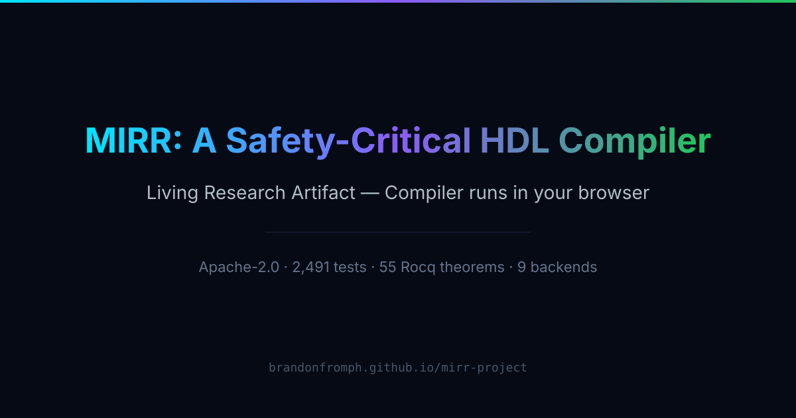
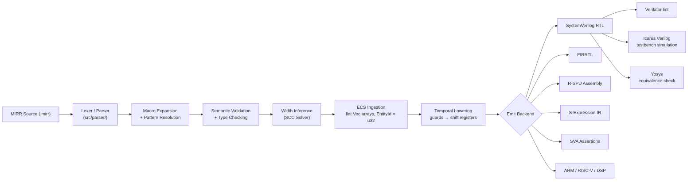

<div align="center">

<a href="https://brandonfromph.github.io/mirr-project/paper/">
  
</a>

**A hardware rule language for safety-critical systems.**

[](https://github.com/brandonfromph/mirr-project/actions)
[](#testing)
[](LICENSE)
[](https://www.rust-lang.org/)
[](#design-philosophy)

</div>

---

## Time as a First-Class Citizen

MIRR is built on the philosophy that **time is not an after-thought.** In traditional HDL design, implementing a temporal rule (e.g., "if signal A is high for 500 cycles") requires manually managing counters, reset logic, and comparison operators. This is error-prone and verbose.

In MIRR, time is a first-class primitive:

```mirr
guard sustained_error {
    when error_signal == true
    for  500 cycles;
}
```

The compiler automatically synthesizes this into a deterministic hardware structure:
- **Shift Registers**: For short delays (e.g., `< 16 cycles`), providing single-cycle response.
- **Binary Counters**: For long delays (e.g., `> 16 cycles`), optimizing for area efficiency.

This ensures your safety rules are enforced with **cycle-accurate precision** and zero jitter.

---

## FuseSoC Integration

MIRR is fully integrated with the [FuseSoC](https://github.com/olofk/fusesoc) package manager. You can use MIRR to generate verified hardware IP cores dynamically during your SoC build process.

To add a MIRR-generated watchdog to your project:
```yaml
# In your .core file
dependencies:
  - brandonfromph:mirr:watchdog:1.0.0
```

---

## What MIRR is

> [!IMPORTANT]
> MIRR is a domain-specific language that compiles **temporal safety rules into synthesizable hardware logic** — directly, without an OS, scheduler, or interrupt handler in the loop.

You write a rule like: *"if airway pressure drops for more than a second, close the valve."* MIRR compiles that into a shift-register chain in RTL that enforces the rule in nanoseconds — with mathematical proof that it cannot be missed.

> [!NOTE]
> The target domain is safety-critical embedded hardware: ventilators, flight controllers, autonomous vehicle brake systems. Places where a scheduling delay is not a crash report — it is a physical consequence.

---

## Why this is hard

Most HDL compilers operate on one of two extremes: raw RTL (no safety abstractions) or high-level C++ synthesis (no hardware timing primitives). MIRR occupies the space between them — but building that space required solving three non-trivial problems:

| Problem | What MIRR does |
|---|---|
| **Temporal correctness** | `for N cycles` guards are compiled to deterministic shift-register chains, not software counters. The temporal contract is enforced in silicon. |
| **Bit-width safety** | A Hindley-Milner-style SCC width solver infers minimum safe widths. Unsafe truncation is a compile-time hard error — not a runtime fault. |
| **Synthesis correctness** | The compiler's IR is a hand-rolled ECS (Entity Component System) — flat `Vec` arrays indexed by `u32` entity IDs, not pointer-chained AST nodes. All synthesis passes iterate contiguous memory, verified by Verilator lint and Icarus Verilog testbench simulation. |

---

## Example

A neonatal respirator emergency clamp:

```mirr
module neonatal_respirator {
    signal airway_pressure: in u16;
    signal clamp_valve:     out bool;

    guard sustained_pressure_drop {
        when airway_pressure < 50
        for  1000 cycles;
    }

    reflex emergency_clamp {
        on sustained_pressure_drop {
            clamp_valve = true;
        }
    }
}
```

If `airway_pressure` stays below 50 for 1000 consecutive clock cycles, `clamp_valve` is set to `true`. The compiler turns the `for 1000 cycles` rule into a shift register chain. No polling loop. No interrupt handler. No kernel.

> [!TIP]
> **Compiled output** (`--emit verilog`):
> ```systemverilog
> module neonatal_respirator (
>     input  logic        clk,
>     input  logic        rst,
>     input  logic [15:0] airway_pressure,
>     output logic        clamp_valve
> );
>     // Shift-register chain: 1000-cycle temporal guard
>     logic [999:0] sustained_pressure_drop_sr;
>     // ... RTL implementation
> endmodule
> ```

---

## Compiler Architecture



The ECS Registry (`src/ecs/registry.rs`) is the compiler's source of truth for all synthesis passes. Hardware declarations (signals, guards, reflexes, properties) are stored as `u32` entity IDs across 21 flat `Vec<Option<Component>>` arrays — pre-allocated at 100,000 entity capacity. No heap fragmentation. No pointer chasing.

---

## Key Technical Facts

| Metric | Value |
|---|---|
| **Tests passing** | 3,469+ (full nextest suite) |
| **Test files** | 61+ dedicated test modules |
| **Unsafe code** | Zero — `#![forbid(unsafe_code)]` in all crates |
| **Clippy warnings** | Zero — `#![deny(warnings)]` enforced in CI |
| **Output formats** | 12+ (SystemVerilog, FIRRTL, JSON, S-expr, SVA, DOT, R-SPU, ARM, RISC-V, DSP, FPGA scaffold, testbench) |
| **Error codes** | 162 unique diagnostic codes (E100–E902) |
| **Formal proofs** | 80+ Rocq (Coq) proofs |
| **Yosys validation** | 11/11 reference designs verified |
| **ECS entity capacity** | 100,000 (pre-allocated, zero GC) |
| **Compiler pipeline stages** | 9 named stages in `run_pipeline()` |
| **FPGA targets** | iCE40, ECP5, Xilinx 7-Series, UltraScale, Gowin, Efinix |

---

## Design Philosophy

> [!WARNING]
> MIRR enforces correctness guarantees at **compile time**, not runtime.

| Constraint | Enforcement mechanism |
|---|---|
| Temporal correctness | Guards compile to shift registers, not software timers |
| Bit-width safety | SCC-based width inference; unsafe truncation is a hard error |
| No unsafe code | `#![forbid(unsafe_code)]` across all crates |
| No unbounded loops | All passes are iterative with explicit bounds (NASA Power-of-10) |
| Zero warnings | `#![deny(warnings)]` enforced in CI |
| Formal verification | 80+ Rocq proofs covering width inference and temporal guard semantics |

The language has exactly three constructs — **Signal**, **Guard**, **Reflex** — plus verification **Properties** and reusable **Patterns**. See the [Tutorial](docs/tutorial.md) for the full guide.

---

## Living Research Artifact

MIRR is published as a Living Research Artifact (LRA) — an interactive paper where the compiler runs live in the browser.

**[Read the interactive paper →](https://brandonfromph.github.io/mirr-project/paper/)**

The paper, the compiler, the Rocq proofs, and the browser demos are one Apache-2.0 licensed artifact. To cite MIRR, use [`paper/CITATION.cff`](paper/CITATION.cff) or cite the commit hash of the version you used.

**Want this format for your own research?** Fork the [LRA Template](https://github.com/brandonfromph/lra-template) — a reusable Apache-2.0 scaffold for interactive papers. See the [LRA-1.0 Specification](template/spec/LRA-1.0.md) for the formal standard.

---

## Getting Started

### Prerequisites

You need the Rust toolchain and (optionally) `iverilog` / `verilator` for RTL simulation:

```bash
# Rust toolchain
curl --proto '=https' --tlsv1.2 -sSf https://sh.rustup.rs | sh

# RTL simulation tools (optional, for simulation tests)
# macOS:
brew install icarus-verilog verilator
# Ubuntu:
sudo apt-get install iverilog verilator
```

### Build

```bash
git clone https://github.com/brandonfromph/mirr-project.git
cd mirr-project
cargo build --release
```

The `mirr-compile` binary is the primary compiler. Invoke it directly:

```bash
# Compile to SystemVerilog RTL
./target/release/mirr-compile examples/neonatal_respirator.mirr --emit verilog

# Compile to FIRRTL
./target/release/mirr-compile examples/flight_controller.mirr --emit firrtl

# All supported emit targets:
# verilog  firrtl  json  sexpr  sva  dot  rspu
```

### Run the Test Suite

```bash
cargo nextest run --workspace --no-fail-fast
```

All 3,469+ tests run headlessly — no GPU, no window, no hardware required.

---

## Toolchain

| Binary | Purpose |
|---|---|
| `mirr-compile` | Primary compiler — MIRR → RTL / FIRRTL / R-SPU |
| `mirrc` | Compiler alias (short form) |
| `mirr-lsp` | Language Server Protocol server for editor integration |
| `mirr-hydrate` | Import Yosys JSON netlists as MIRR source |

**WASM demo** — the compiler runs in-browser via WebAssembly. Build with:
```bash
rustup target add wasm32-unknown-unknown
cargo install wasm-pack
wasm-pack build crates/mirr-wasm --target web --out-dir ../../demos --release
```

---

## Documentation

| Document | Description |
|----------|-------------|
| [Tutorial](docs/tutorial.md) | 10-lesson beginner guide — no hardware experience needed |
| [Error Codes](docs/error_codes.md) | Complete catalogue of compiler diagnostics (E1xx–E9xx) |
| [Type System](docs/type-system.md) | Signed/unsigned types, SCC width inference, and error codes |
| [R-SPU ISA Spec](docs/rspu_isa_spec.md) | R-SPU instruction set architecture and register file |
| [FPGA Targets Guide](docs/fpga-targets-guide.md) | Board support for iCE40, ECP5, Xilinx 7, Ultrascale, Gowin, Efinix |
| [MAPE-K Guide](docs/mape-k-guide.md) | Autonomic Monitor–Analyze–Plan–Execute–Knowledge loop |
| [S-Expression Guide](docs/sexpr-guide.md) | Homoiconic IR, reader macros, and bounded evaluation |
| [Migration Guide](docs/migration-guide.md) | Upgrade notes for 0.1.0 to 0.3.0 |
| [Roadmap](docs/roadmap.md) | Phase 0–9 project roadmap |
| [Architecture](docs/ARCHITECTURE.md) | ECS data model, pipeline stages, and crate topology |
| [CHANGELOG](CHANGELOG.md) | Versioned change history |

---

## Roadmap

- [x] Phase 0–6 — Foundation through integration pipeline
- [x] Phase 7a — Safety properties and SVA assertion emission
- [x] Phase 7b — Homoiconic pattern system (`def`/`reflect`)
- [x] Phase 7c — Advanced type system (MEGA-1)
- [x] Phase 7d — S-Expression homoiconic IR (MEGA-2)
- [x] Phase 7e — R-SPU instruction set architecture (MEGA-3)
- [ ] Phase 7f — Proof-carrying code
- [ ] Phase 8 — Multi-core fabric & tape-out
- [ ] Phase 9 — Production certification (DO-178C, IEC 62304, ISO 26262)

See [docs/roadmap.md](docs/roadmap.md) for the full technical specification of each phase.

---

## Contributing

Contributions are welcome — particularly from researchers in formal verification, hardware synthesis, and safety-critical systems. Read [CONTRIBUTING.md](CONTRIBUTING.md) before opening a PR.

All contributions must pass:
```bash
cargo nextest run --workspace   # all tests
cargo clippy -- -D warnings     # zero warnings
cargo fmt --check               # formatting
```

---

## License

Distributed under the Apache-2.0 License. See [`LICENSE`](LICENSE) for the full terms.

The interactive paper, compiler, proofs, and WASM demos are one unified Apache-2.0 artifact and cannot be separated for journal submission under a copyright transfer agreement.

---

## Acknowledgments

**Built on the work of:**
- Xiao et al. (2025) — [Cement2: Temporal Hardware Transactions](https://doi.org/10.48550/arXiv.2511.15073)
- Li et al. (2025) — [SmaRTLy: RTL Optimization with Logic Inferencing](https://doi.org/10.48550/arXiv.2510.17251)
- Wang et al. (2026) — [FIRWINE: Formally Verified Width Inference](https://doi.org/10.48550/arXiv.2601.12813)
- Pnueli, A. (1977) — [The Temporal Logic of Programs](https://doi.org/10.1109/SFCS.1977.32)
