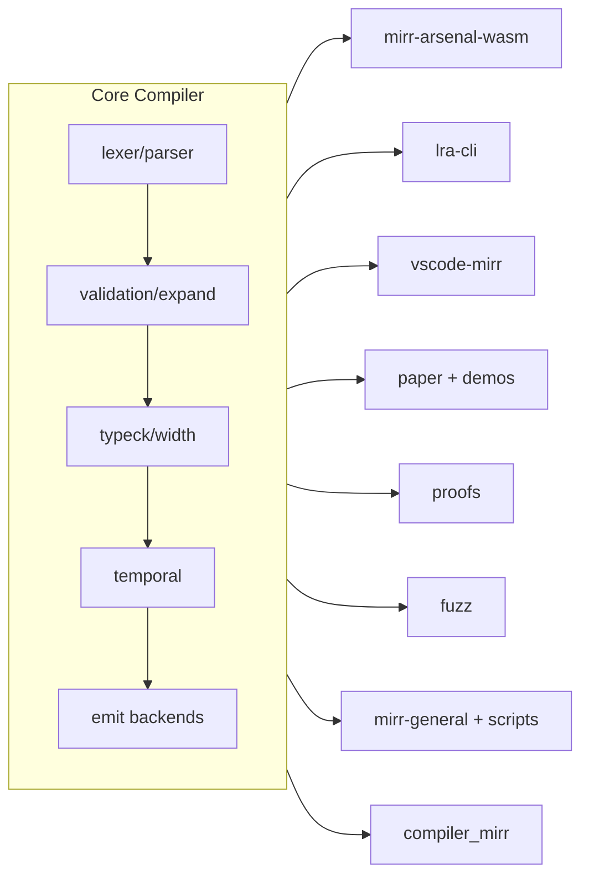

# MIRR Repo Understanding (Developer Onboarding)

Date: 2026-04-04

This document provides a practical map of the repository for developers. It answers:
- What does this repo do end-to-end?
- Where does each responsibility live?
- What should developers read first for a given task?
- What commands and tests validate that a change did not break behavior?

## 1. One-Screen Mental Model

MIRR is a safety-critical compiler platform with three kinds of surfaces:

1. Core compiler: parse -> validate/expand -> type/width -> temporal lowering -> emit.
2. Control planes: MRT / Presidential Arsenal, KB-lite, and private campaign planning.
3. Consumers and bridges: WASM, LRA, MCP, VS Code, paper/demos, proofs, fuzz, and CI scripts.

Inputs:
- MIRR language (Signal/Guard/Reflex + properties/patterns)

Outputs:
- SystemVerilog, FIRRTL, JSON netlist, DOT graphs, S-expression IR, R-SPU assembly/binary

Assurance layers:
- Integration tests (`tests`)
- Fuzz harnesses (`fuzz`)
- Formal proofs (`proofs`)
- Gate orchestration (`mirr-general` + scripts)

## 2. Topology Status

The repository topology is real, but the docs do not all describe it consistently.

Use the following layers when reasoning about repository responsibilities:
- Core compiler: the Rust compiler pipeline in `src/`.
- Public governance: `docs/roadmap.md`, `docs/repo-topology.md`, `docs/consumer-contracts.md`.
- Private planning: `.campaigns-private.md` and `.lra-roadmap-private.md` for pre-execution strategy only.
- Command/control: MRT / Presidential Arsenal binaries and `mcp_server` as the bridge surface.
- Consumer surfaces: WASM, LRA, VS Code, paper/demos, proofs, fuzz, and scripts.

Resolved alignment updates:
- `docs/repo-topology.md` now names the MRT / Presidential Arsenal control plane and `crates/mirr-arsenal-wasm`.
- `docs/consumer-contracts.md` now includes `crates/mirr-arsenal-wasm` and tightens the MRT bridge contract.

Remaining documentation drift:
- `docs/file-tree.md` is a dated snapshot, not a live canonical topology. It omits canonical surfaces like `demos`, `proofs`, and `scripts`.
- `paper/` and `docs/paper/demos/` are major delivery surfaces in the repository, but the canonical topology docs only compress them into `demos` and do not describe the paper-side architecture directly.
- `docs/roadmap.md` had status drift and a phase-label collision. The status line is now corrected; the numbering still needs a future cleanup if you want the roadmap itself renumbered.
- `docs/self_hosting_status.md`, `docs/self_hosting_milestone.md`, and the bootstrap/parity flow do not agree on whether self-hosting is complete; current evidence indicates stage-1 hosted self-hosting is in progress.
- `vscode-mirr` package metadata says there is no LSP or compiler service in the package, while the README describes an external `mirr-lsp` client integration. This indicates the package is a syntax/theme/icon surface, not a full compiler host.

Source-of-truth priority:
- Source and manifests over topology summaries.
- `Cargo.toml`, package manifests, and entrypoint code over snapshot docs.
- `GEMINI.md` and `MIRR_ARSENAL_README.md` for MRT / Presidential Arsenal terminology.
- `.campaigns-private.md` and `.lra-roadmap-private.md` for private planning only; never as public topology.
- `docs/kb-lite-design.md` for the local KB-lite governance boundary.
- `docs/roadmap.md` for phase intent, but only after accounting for the status drift above.

## 3. Main Projects At A Glance

The repository is organized into a small set of primary layers; other directories primarily provide support, testing, documentation, or automation.

### Core Layer

| Project | What it is | Architecture overview | Current phase/status |
|---|---|---|---|
| `src` / core compiler | The compiler engine | Front-end (`lexer`/`parser`) -> semantic validation -> type/width solving -> temporal lowering -> emit backends | Roadmap phases 0-7e complete; 7f+ is not started |
| `compiler_mirr` | Self-hosting compiler subset | MIRR-written bootstrap implementation for lexer/parser/semantic/temporal layers | Stage-1 hosted self-hosting, in progress |

### Control Plane Layer

| Project | What it is | Architecture overview | Current phase/status |
|---|---|---|---|
| `MRT / Presidential Arsenal` | The command/control plane | `mirr-audit`, `mirr-brain`, `mirr-wave`, `mirr-general`, `mirr-lsp`; KB-lite is the repo-local governance plane surfaced through `mcp_server`; `mirr-brain` replaces the heavy KB role | Shared governance/roadmap layer; legacy KB is retired/unavailable as a live command surface |
| Private campaign planning | Pre-execution strategy docs | `.campaigns-private.md` and `.lra-roadmap-private.md`, both gitignored and never pushed | Internal-only planning lane |

### Consumer / Bridge Layer

| Project | What it is | Architecture overview | Current phase/status |
|---|---|---|---|
| `crates/mirr-wasm` | Browser/WASM compiler API | wasm-bindgen facade over `run_pipeline` with compile targets for Verilog/FIRRTL/DOT/JSON/S-expr/R-SPU and a 65 KiB source cap | Consumer surface; parity-gated |
| `crates/mirr-arsenal-wasm` | Arsenal/RWFI2 contract bridge | WASM validation and compile-contract wrapper over the core compiler; exposes deterministic compile checks per target | Consumer surface; parity-gated |
| `crates/lra-cli` | Living Research Artifact CLI | Arsenal-facing CLI surface for Markdown/HTML validation, local serving, dependency/status search, signing, receipts, and optional compile integration | Arsenal-facing CLI surface; validated by LRA checks |
| `mcp_server` | MRT bridge | Stdio MCP bridge and KB-lite interface plane exposing `mrt_audit`, `mrt_brain_get`, and `mrt_general_ci`, plus a stubbed `mrt_semantic_hover` handler, dispatching to the `mirr-*` CLI family | Bridge surface; contract-tested |
| `vscode-mirr` | VS Code package | Syntax, icons, theme, language config, and an external `mirr-lsp` client path; package metadata explicitly says no compiler service ships here | Consumer/IDE surface; package-dry-run gated |
| `paper` + `demos` | Interactive paper and browser demo assets | Static site plus generated wasm/js/ts artifacts consumed by the paper UI and demo pages | Delivery surface; tied to WASM/API stability |

### Assurance Layer

| Project | What it is | Architecture overview | Current phase/status |
|---|---|---|---|
| `proofs` | Formal verification | Rocq/Coq proofs for width, R-SPU, and language properties, split by theorem family | Active support surface; correctness gate |
| `fuzz` | Robustness testing | libFuzzer targets for parser, pipeline, type, width, temporal, and S-expression paths with seed corpora | Active support surface; crash-safety gate |
| `scripts` / top-level wrappers | Automation and governance | CI wrappers, proposal validation, repo metrics, coverage gates, and execution helpers | Active support surface; automation layer |

### Key Points Made Explicit In This Map

1. Main projects are named directly rather than implied through directory lists.
2. Each main project includes an architecture summary, not only a file reference.
3. The roadmap/status column distinguishes roadmap-phased projects from consumer/support surfaces.

## 4. Roadmap Crosswalk

This phase map follows the numbering used in the public roadmap and supporting documents.

| Phase | Status | What it is |
|---|---|---|
| Phase 0 | Complete | Foundation |
| Phase 1 | Complete | Mini MIRR DSL |
| Phase 2 | Complete | Temporal guard compiler |
| Phase 3 | Complete | Logic simplifier |
| Phase 4 | Complete | Width inference (4a + 4b) |
| Phase 5 | Complete, despite one outdated summary line saying partial | MAPE-K simulation harness (5a + 5b) |
| Phase 6 | Complete | Integration and visualization |
| Phase 7a | Complete | Safety properties and SVA emission |
| Phase 7b | Complete | Pattern system (`def`/`reflect`) |
| Phase 7c | Complete | Advanced type system |
| Phase 7d | Complete | S-expression IR |
| Phase 7d (roadmap label collision) | Complete | Metaprogramming and code generation |
| Phase 7f | Not started | Proof-carrying code infrastructure |
| Phase 7g | Not started | Symbolic evaluation engine |
| Phase 7h | Not started | MAPE-K hardware realization |

Notes:
- Compiler platform implementation is complete through the phase-7 deliverables present in code, while 7f+ remains future work.

## 5. First 90 Minutes: Repository Onboarding Sequence

For onboarding, use this sequence.

1. Read product + constraints:
- `README.md`
- `CLAUDE.md`
- `.github/copilot-instructions.md`

2. Read compiler API surface:
- `src/lib.rs` (all public modules in one place)

3. Read entrypoint binaries:
- `src/bin/mirr-compile/main.rs` (compile path and emit target selection)
- `src/bin/mirr-general.rs` (CI waves, parity gates, orchestration)

4. Read one representative test per stage:
- `tests/parser_edge_cases_tests.rs`
- `tests/semantic_validation_tests.rs`
- `tests/typecheck_tests.rs`
- `tests/width_solver_tests.rs`
- `tests/temporal_compiler_tests.rs`
- `tests/emit_verilog_tests.rs`
- `tests/orchestrator_parity_tests.rs`

5. Run a minimal safe command ladder:
- `cargo fmt --all -- --check`
- `cargo check --all-targets`
- `cargo test --test parser_edge_cases_tests`
- `cargo test --test emit_verilog_tests`

6. Run full confidence gate when needed:
- `cargo run --bin mirr-general -- ci --format json`

## 6. Directory-by-Directory: What Lives Where

### Compiler core (`src/`)

Top-level module inventory comes from `src/lib.rs`.

Key modules and responsibilities:
- `src/parser/`, `src/lexer/`: language front-end and AST construction
- `src/validation/`: semantic validation checks
- `src/expand/`: pattern expansion/inlining
- `src/typeck/`: type checking, extended type features
- `src/width/`: width constraint solving (including SCC paths)
- `src/temporal/`: guard lowering to deterministic temporal netlist
- `src/emit/`: all output backends
- `src/sexpr/`: S-expression IR conversion/roundtrip
- `src/pipeline.rs`: stage orchestration and `PipelineConfig`
- `src/error.rs`, `src/diagnostic/`: error family + rendering
- `src/sat/`, `src/symbolic/`, `src/totality/`, `src/hls/`, `src/mape_k/`: advanced/optional analysis and generation subsystems

### Binary entrypoints (`src/bin/`)

- `src/bin/mirr-compile/main.rs`: main compiler CLI, target dispatch, output writing
- `src/bin/mirr-lsp.rs`: language-server process for editor diagnostics
- `src/bin/mirr-general.rs`: wave-based orchestration for checks/tests/parity/proofs

### Tests (`tests/`)

Massive integration test matrix. The folder is organized by subsystem and campaign suites.

Important categories:
- Parser/semantic/type/width/temporal/emit suites
- Self-hosting/parity suites
- Consumer contract suites (`*_parity_tests.rs`, `rwfi2_mrt_contract_tests.rs`)
- Mega campaign suites (`mega*` files)
- EDA integration under `tests/eda/`

### Consumer crates (`crates/`)

- `crates/mirr-wasm`: compiler APIs exported to JS/WASM consumers
- `crates/mirr-arsenal-wasm`: Arsenal-focused validation/contract bridge
- `crates/lra-cli`: Living Research Artifact tooling, validation, serving, signing

### Non-Rust consumer surfaces

- `mcp_server`: Node/TS MCP server around safe tools + compiler operations
- `vscode-mirr`: syntax/theme/icon extension (editor UX surface)
- `demos` and `docs/paper/demos`: wasm artifact packages used by interactive surfaces

### Private planning surfaces

- `.campaigns-private.md`: private campaign roadmap, gitignored, never pushed.
- `.lra-roadmap-private.md`: private LRA strategy, gitignored, never pushed.
- These are planning aids, not canonical repo topology.

### Formal + robustness

- `proofs/width`, `proofs/rspu`, `proofs/language`: Rocq/Coq formal proof projects
- `fuzz/`: libFuzzer targets for parser/pipeline/type/width/temporal/S-expression

### Governance/documentation

Source file flow in practice:

1. Parse
- `src/lexer/` + `src/parser/`
2. Validate + expand
- `src/validation/` and `src/expand/`
- Type correctness and safe widths

4. Temporal lowering
- `src/temporal/`
- Guard semantics translated to temporal netlist structures

5. Emit target
- `src/emit/*`
- Verilog, FIRRTL, JSON, DOT, S-expression, R-SPU, and related output surfaces

Main orchestrator:
Primary error ranges by subsystem:
- E1xx: parse/lexer/parser
- E2xx: semantic validation
- E3xx: temporal lowering
- E5xx: width inference
- E6xx: type checking
- E7xx: R-SPU emission/runtime path
- E8xx: S-expression
- E9xx+: SAT/symbolic/totality advanced subsystems

When debugging, always map failing code range to owning directory first.

## 9. Build, Test, CI, and Parity: What To Run

Default local gate set:
- `cargo fmt --all -- --check`
- `cargo check --all-targets`
- `cargo clippy --all-targets -- -D warnings`
- `cargo test --all`

Canonical orchestration:
- `cargo run --bin mirr-general -- ci --format json`

What `mirr-general` orchestrates (high-level):
- Format wave
- Clippy wave
- Test wave (nextest/cargo test strategy)
- Proof wave (`proofs/*` via `make`)
- Consumer parity wave (MCP tests, VS Code pack dry-run, WASM crate checks)

Useful targeted commands:
- `cargo test --test self_hosting_parity_tests`
- `cargo test --test orchestrator_parity_tests`
- `cargo test --test mega10_composite_integration_tests`
- `cargo test --test mega11_meta_stage_tests`

## 10. Cross-Project Contract Map (Who Depends on What)

Compiler core (`src`) is the center.

Downstream contracts:
- WASM APIs (`crates/mirr-wasm`) must stay aligned with pipeline and diagnostics behavior
- Arsenal contracts (`crates/mirr-arsenal-wasm`) depend on deterministic compile/validation behavior
- MRT / Presidential Arsenal (`mirr-audit`, `mirr-brain`, `mirr-wave`, `mirr-general`, `mirr-lsp`) is the command/control plane; `mcp_server` bridges into it
- KB-lite keeps proposal and campaign workflows local-first; `mcp_server` is the interface plane for those surfaces
- LRA CLI (`crates/lra-cli`) is Arsenal-facing tooling and optionally invokes the compiler pipeline
- VS Code extension (`vscode-mirr`) depends on language syntax assets; LSP behavior depends on `mirr-lsp`
- Demos/paper (`demos`, `docs/paper/demos`, `paper`) depend on generated wasm artifacts and stable JS interface

Impact rule for non-trivial changes:
- If you modify parser/type/width/temporal/emit, assume consumer impact until proven otherwise.

## 11. Dependency Inventory (Per Project)

This section lists direct dependencies from manifests and what they are used for.

### Root Rust workspace (`Cargo.toml`, package: `nasa-rust-project`)

Runtime dependencies:
- `anyhow`: ergonomic error propagation
- `clap` (derive): CLI argument parsing
- `ed25519-dalek`: signing/verification operations
- `glob`: file pattern expansion in tooling paths
- `rand`: randomness support
- `regex`: pattern matching utilities
- `serde` (derive): serialization models
- `serde_json`: JSON IO for diagnostics/contracts/netlists
- `sha2`: hashing/integrity
- `chrono` (serde): timestamps/serialized time
- `num_cpus`: worker count sizing

Target-specific:
- `getrandom` (`wasm32`, `js`): random source compatibility in wasm builds

Dev dependencies:
- `criterion`: benchmark harnesses
- `tempfile`: temporary file/dir support in tests

### `crates/mirr-wasm/Cargo.toml`

Dependencies:
- `nasa-rust-project` (path): embed compiler pipeline
- `wasm-bindgen`: Rust/JS wasm boundary
- `serde`, `serde_json`: payload and JSON result envelopes
- `console_error_panic_hook`: browser panic visibility
- `getrandom` (`wasm32`, `js`): wasm random support

### `crates/mirr-arsenal-wasm/Cargo.toml`

Dependencies:
- `wasm-bindgen`: JS-facing bindings
- `serde`, `serde_json`: contract payloads
- `nasa-rust-project` (path): compiler-backed validation/contract logic

### `crates/lra-cli/Cargo.toml`

Dependencies:
- `clap`: CLI parsing
- `tiny_http`: local serving
- `notify`: filesystem watching
- `pulldown-cmark` (html): markdown rendering
- `sha2`: hashing/integrity
- `serde`, `serde_json`: metadata and JSON operations
- `ureq`: HTTP requests
- `ed25519-dalek`, `rand`: signing workflows
- `nasa_rust_project` (path alias to `nasa-rust-project`): compiler integration

### `fuzz/Cargo.toml`

Dependencies:
- `libfuzzer-sys`: fuzz runtime
- `nasa-rust-project` (path): fuzz target entry into core pipeline/modules

### Root `package.json`

- No dependencies; workspace metadata package only.

### `mcp_server/package.json`

Runtime dependencies:
- `@modelcontextprotocol/sdk`: MCP protocol SDK
- `ajv`, `ajv-formats`: JSON schema validation
- `body-parser`, `express`: HTTP/server glue
- `glob`: filesystem pattern matching

Dev dependencies:
- `@types/express`, `@types/glob`, `@types/node`: TS typings
- `ts-node`: dev execution
- `typescript`: compilation

### `vscode-mirr/package.json`

- No npm dependencies declared.
- Uses VS Code engine requirement (`vscode ^1.75.0`) and declarative contributions.

### `demos/package.json` and `docs/paper/demos/package.json`

- No dependencies declared.
- Artifact package role: publish generated `mirr_wasm.js` + `.wasm` + typings.

## 12. If You Touch X, Read Y, Run Z

### Parser or validation changes
Read:
- `src/parser/`, `src/validation/`, `src/pipeline.rs`
Run:
- `cargo test --test parser_edge_cases_tests`
- `cargo test --test semantic_validation_tests`
- `cargo check --all-targets`

### Type or width changes
Read:
- `src/typeck/`, `src/width/`, `src/pipeline.rs`
Run:
- `cargo test --test typecheck_tests`
- `cargo test --test width_solver_tests`
- `cargo test --test width_scc_tests`

### Temporal or emit changes
Read:
- `src/temporal/`, `src/emit/`, `src/bin/mirr-compile/main.rs`
Run:
- `cargo test --test temporal_compiler_tests`
- `cargo test --test emit_verilog_tests`
- `cargo test --test emit_firrtl_tests`
- `cargo test --test emit_rspu_tests`

### Orchestrator/parity changes
Read:
- `src/bin/mirr-general.rs`, `src/bin/mirr_general/*`
Run:
- `cargo test --test orchestrator_scheduler_tests`
- `cargo test --test orchestrator_cache_tests`
- `cargo test --test orchestrator_parity_tests`

### WASM/MCP/IDE/LRA changes
Read:
- `crates/mirr-wasm`, `crates/mirr-arsenal-wasm`, `mcp_server`, `vscode-mirr`, `crates/lra-cli`
Run:
- `cargo check --manifest-path crates/mirr-wasm/Cargo.toml`
- `cargo check --manifest-path crates/mirr-arsenal-wasm/Cargo.toml`
- `npm --prefix mcp_server test`
- `npm --prefix vscode-mirr pack --dry-run`
- `cargo test -p lra-cli`

## 13. Practical Pitfalls In This Workspace

- PowerShell cargo aliasing can be inconsistent; prefer `cargo.exe` if command resolution looks wrong.
- Nested orchestration on Windows may contend on lock/target dirs; use `CARGO_TARGET_DIR=target/ci-wave` for isolated runs.
- Do not trust stale status docs/logs over source and tests.
- Self-hosting is active but still evolving; parity tests are a better truth source than narrative status files.

## 14. Canonical Docs To Link, Not Duplicate

- `docs/doc-index.md` (map of docs)
- `docs/testing-guide.md` (testing conventions)
- `docs/error_codes.md` (error catalog)
- `docs/type-system.md` (type system)
- `docs/roadmap.md` (phase status)
- `docs/contributing.md` (standards)
- `.github/skills/propose-campaign/SKILL.md` (campaign workflow)

## 15. Bottom Line

This repository is a compiler-centered platform with multiple first-class consumers and assurance layers. To understand it as a developer, reason in three dimensions:

1. Compiler stage correctness
2. Consumer contract compatibility
3. Assurance evidence (tests/parity/proofs/fuzz)

Keeping these three dimensions in view makes the repository predictable and navigable.
