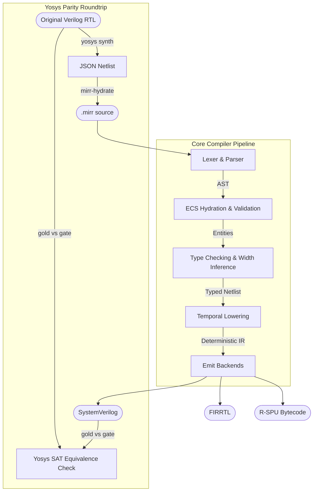
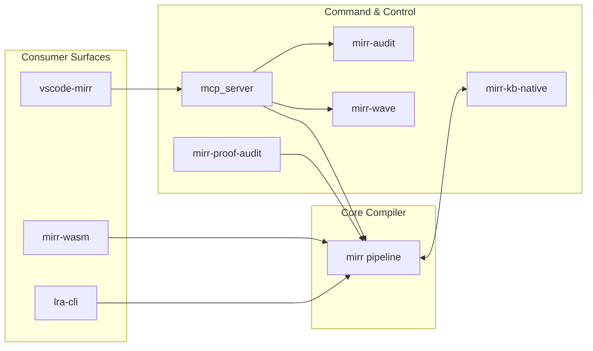

# MIRR Project Architecture & Directory Topology

Date: 2026-05-17

This document provides a comprehensive map of the repository, detailing the structural layout, data flow pathways, and architectural components of the MIRR compiler platform.

> [!IMPORTANT]
> **MAINTENANCE MANDATE**: This file is the single source of truth for the repository's topology. Under the project's zero-debt policy, whenever a new module, crate, or major architectural flow is added, moved, or removed, **you must immediately update this document** to reflect the new state. Outdated architecture mapping is strictly forbidden.

## 1. Directory Map

A clear tree breakdown explaining the directory structure of the repository:

```text
mirr-private/
├── src/                      # Core Compiler Pipeline
│   ├── ast/                  # Abstract Syntax Tree definitions
│   ├── parser/               # Front-end parsing (Lexer & Parser)
│   ├── ecs/                  # Entity Component System (ECS) architecture (Registry)
│   ├── cert/                 # MEGA-4 Proof certificate format & MEGA-16 PCC verifier
│   ├── typeck/               # Type checking & constraint validation
│   ├── width/                # Width constraint solving (SCC paths)
│   ├── temporal/             # Temporal lowering of hardware guards
│   ├── symbolic/             # Hardware-preparatory symbolic evaluation engine
│   ├── emit/                 # Emission backends (SystemVerilog, FIRRTL, R-SPU, etc.)
│   ├── bin/                  # Executable entrypoints (mirr-compile, mirr-general, etc.)
│   └── lib.rs                # Public module exports
├── crates/                   # Consumer & Control Plane Surfaces
│   ├── mirr-wasm/            # WASM compilation API (browser/JS consumers)
│   ├── mirr-arsenal-wasm/    # Validation and compile-contract wrapper
│   ├── lra-cli/              # Living Research Artifact CLI tooling
│   ├── mirr-kb-native/       # Knowledge Base native engine (RAG / Vector search)
│   └── mirr-mcp-control-plane/ # Model Context Protocol bridge & governance
├── tests/                    # Integration & Parity Test Matrix
├── fuzz/                     # Fuzzing harnesses for robustness
├── proofs/                   # Formal verification (Coq/Rocq)
├── docs/                     # Documentation and Architecture definitions
├── proposals/                # Architectural proposals and RFCs
├── rspu_chip/                # Primary hardware project (16-core R-SPU processor)
├── stdlib/                   # Standard library definitions
└── compiler_mirr/            # Self-hosting bootstrap implementation
```

## 2. One-Screen Mental Model

MIRR is a safety-critical compiler platform (61k+ LOC) with three distinct layers:

1. **Core Compiler Sub-Engines**: 14 specialized modules (Temporal, Symbolic, SAT, HLS, etc.) that perform rigorous behavioral-to-physical translation.
2. **Control Planes**: MRT / Presidential Arsenal and KB-native (RAG) for autonomic governance and knowledge-backed synthesis.
3. **Consumer Bridges**: WASM, LRA-CLI, and MCP-Control-Plane providing multi-surface accessibility.

**Inputs:**
- MIRR specifications (Signals, Guards, Reflexes, Properties, Patterns)

**Outputs:**
- Verilog RTL (always_ff synchronous), FIRRTL, R-SPU Assembly, JSON Netlists, Formal S-Expressions.

## 3. The 14 Architectural Sub-Engines

The core of MIRR is partitioned into 14 high-assurance engines, each adhering to NASA's Power-of-10 rules for ultra-reliable execution.

### Logic & Optimization
1.  **Temporal Guard Compiler** (`src/temporal/compiler.rs`): Translates high-level temporal guards into deterministic shift-register and counter primitives.
2.  **SAT Logic Solver** (`src/sat/mod.rs`): A bounded iterative DPLL solver for proving expression equivalences and verifying simplification candidates.
3.  **High-Level Synthesis (HLS) Optimizer** (`src/hls/mod.rs`): Performs ASAP/ALAP scheduling, resource sharing, and FIFO streaming synthesis for hardware realization.
4.  **Register Retiming Optimizer** (`src/temporal/retiming.rs`): Employs Leiserson-Saxe retiming to minimize critical path delay by moving registers across combinational logic.

### Verification & Assurance
5.  **Symbolic Evaluation Engine** (`src/symbolic/mod.rs`): Implements interval-based abstract interpretation to prove signal value bounds and structural netlist equivalence.
6.  **Totality Engine** (`src/totality/mod.rs`): Verifies the five Pillars of Totality: resource bounds, output completeness, guard coverage, temporal finiteness, and dependency acyclicity.
7.  **S-Expression Transpiler** (`src/sexpr/convert/to_sexpr.rs`): Generates homoiconic IR for formal verification bridges (Z3, Rocq).
8.  **R-SPU Silicon Simulator** (`src/emit/rspu_sim/mod.rs`): Provides cycle-accurate, bit-precise simulation for 16-core R-SPU programs.

### Infrastructure & Orchestration
9.  **ECS Registry** (`src/ecs/registry.rs`): A high-performance SoA (Structure of Arrays) registry managing up to 1M hardware entities. Currently serves as the final synthesis IR.
10. **Cross-Module Symbol Resolver** (`src/symbols/resolver.rs`): Manages cross-crate namespace resolution and visibility.
11. **S-Expression "Code as Data" Engine** (`src/sexpr/mod.rs`): A homoiconic IR with a bounded, iterative eval/apply core. **Current Status**: Not wired to the main pipeline. Used exclusively for self-hosting bootstrap and formal verification bridges.
12. **Semantic Type Checker** (`src/typeck/mod.rs`): Enforces signedness consistency. **Current Role**: Production-grade AST checker; ECS-native typechecking is currently a shadow gate.
13. **MAPE-K Analyzer** (`src/mape_k/analyzer.rs`): Evaluates bounded LTL properties over rolling windows for autonomic safety.
14. **MAPE-K Telemetry Bridge** (`src/mape_k/bridge/mod.rs`): Orchestrates the 16-core telemetry fabric (Proposal 045) for cross-core safety coordination.

## 4. Data Flow Pathways

The following pathways describe the lifecycle of a MIRR specification:

1. **Compiler Pipeline Flow (Triple-Brain Sync):** 
   - **Ingestion**: Source code is ingested by the [Lexer/Parser](../src/parser/module_parser/mod.rs), generating an AST.
   - **Hydration 1 (Expansion)**: The AST is partially hydrated into the [ECS Registry](../src/ecs/registry.rs) to resolve pattern definitions.
   - **Duality Expansion (Hazard)**: Patterns are currently expanded ONLY via the legacy AST engine. The [S-Expression Macro Expander](../src/sexpr/macro_expand.rs) is functional but not yet integrated into the production pipeline.
   - **AST Validation**: The expanded AST undergoes [Semantic Validation](../src/validation/semantic.rs) and production type checking.
   - **Hydration 2 (Shadow Gate)**: The validated AST is hydrated into the Registry for "Shadow Gate" parity checks.
   - **AST Optimization**: [Width Solver](../src/width/solver.rs) and Simplification passes are performed on the AST.
   - **Hydration 3 (Synthesis)**: The final, optimized AST is hydrated a third time into a fresh Registry. This is the **Absolute Source of Truth** for synthesis.
   - **Temporal Lowering**: The ECS Registry is used by [Temporal Lowering](../src/temporal/mod.rs) to close the "Temporal Seam," lowering guards into hardware primitives.
   - **Emission**: [Emission Backends](../src/emit/mod.rs) generate the final target artifacts from the synchronized state.

2. **Control Plane & RAG Integration:**
   - The [MCP Semantic Bridge](../crates/mirr-mcp-control-plane/) routes cross-subsystem tool calls.
   - The [Knowledge Base Engine](../crates/mirr-kb-native/) serves as a RAG vector store. The compiler queries `mirr-kb-native` for synthesis precedents and formal proofs before resolving complex guard patterns.

3. **Consumer Facades:**
   - The [mirr-wasm](../crates/mirr-wasm/) crate provides a JS-compatible binding over the core compiler, enabling browser-based IDEs and demonstrations.
   - The [lra-cli](../crates/lra-cli/) interacts with the Arsenal tooling for markdown/HTML validation and receipt signing.

4. **Yosys-to-MIRR Roundtrip Parity Validation Pipeline:**
   - Arbitrary input Verilog/RTL is synthesized using Yosys into a technology-mapped JSON netlist.
   - The [MIRR Hydrator](../src/bin/mirr-hydrate.rs) ingests this JSON and maps the cells directly back into MIRR signals and reflexes.
   - The compiled MIRR output is then lower-synthesized again via Yosys and formally verified using SAT Equivalence Checking (`equiv`) to guarantee absolute codegen parity and correct optimization.

## 4. Architectural Component Graphs

### Core Pipeline Architecture



### Ecosystem Integration Map



## 4.5 Formal Proofs Topology (proofs/)

The repository maintains rigorous formal verification infrastructure in the `proofs/` directory:

- **`proofs/compiler/`**: Coq/Rocq verification of AST simplification passes.
  - `ConstFold.v`: Proves semantic preservation of constant folding on arithmetic expressions.
  - `Simplify.v`: Equivalence proofs for logic simplification rules.
- **`proofs/cert/`**: Formal specification and totality proofs of Proof-Carrying Code (PCC) boundary conditions.
  - `Verifier.v`: Axiomatizes safety invariants for dynamic hardware and software bounds.
- **`proofs/mape_k/`**: Proves behavioral equivalence of software and hardware control loops.
  - `Equivalence.v`: Relates abstract software MAPE-K logic to the synthesized gate-level representations.
- **Tooling (`src/bin/mirr-proof-audit.rs`)**:
  - Automatically maps and audits Rocq proof coverage against compiled AST nodes, reporting proof densities and gaps for formal CI gates.

## 4.6 R-SPU 16-Core Architecture (rspu_chip/)

The `rspu_chip/` directory houses the complete structural hardware layout of the RS-16 processor, a 16-core "Reflexive Signal Processing Unit" baseline.

- **64-bit Tagged-Word Specification (`core/types.mirr`)**:
  - Encodes the standard 64-bit word format: `[63:40]` Reserved (24 bits), `[39:36]` Provenance tracking (4 bits), `[35:32]` Hardware Type Tag (4 bits), and `[31:0]` Raw Data Payload (32 bits).
- **Core Subsystems**:
  - **Upgraded Tagged-Word ALU** (`core/alu.mirr`): A high-performance 64-bit unit using masked-range optimization. It performs hardware type dispatch and dynamic arithmetic safety trap generation, utilizing iterative bit-width narrowing (E504/E505 resolution).
  - `core/regfile.mirr`: Bounded register file (256x64-bit tagged words) with concurrent dual read and single write lines.
  - `core/pipeline.mirr`: Bounded 5-stage pipeline (IF, ID, EX, MEM, WB) with hardware-enforced dynamic verification bounds.
- **Interconnect & SoC Integration**:
  - **NoC Interconnect** (`interconnect/noc_router.mirr`): A 16-port packet-switched router supporting broadcast and star topology routing across the multi-core fabric.
  - **16-Core SoC** (`rspu_top.mirr`): Integrates 16 R-SPU cores via the NoC router. Implements a **DCE Protection Strategy** by driving physical `out_pc` and `out_data` pins to prevent Yosys Dead Code Elimination of the core datapaths.
- **Verification & Safety**:
  - `verification/pcc_verifier.mirr`: Safe IF-stage hardware gatekeeper enforcing dynamic verification bounds.
  - `verification/tmr_voter.mirr`: Triple-Modular Redundancy (TMR) majority voter mask for physical fault mitigation.

## 5. Main Projects At A Glance

### Core Layer

| Project | What it is | Architecture overview | Current phase/status |
|---|---|---|---|
| [`src`](../src) / core compiler | The compiler engine | Front-end -> semantic validation -> type/width solving -> temporal lowering -> emit backends | Phases 0-7h complete; 7i+ in progress |
| [`src/bin/mirr-hydrate.rs`](../src/bin/mirr-hydrate.rs) | MIRR Hydrator | Converts Yosys JSON technology-mapped netlists to structured MIRR files | Core component; complete and verified |
| [`src/bin/mirr-proof-audit.rs`](../src/bin/mirr-proof-audit.rs) | Proof Auditor | Audits coverage of formal proofs across compiler AST and emission nodes | Phase 7i tool; initialized |
| [`compiler_mirr`](../compiler_mirr) | Self-hosting compiler subset | MIRR-written bootstrap implementation | Stage-1 hosted self-hosting, in progress |

### Control Plane Layer

| Project | What it is | Architecture overview | Current phase/status |
|---|---|---|---|
| `MRT / Presidential Arsenal` | The command/control plane | `mirr-audit`, `mirr-brain`, `mirr-wave`, `mirr-general`, `mirr-lsp`; KB-lite local governance via `mcp_server` | Shared governance/roadmap layer |

### Consumer / Bridge Layer

| Project | What it is | Architecture overview | Current phase/status |
|---|---|---|---|
| [`crates/mirr-wasm`](../crates/mirr-wasm) | Browser/WASM compiler API | wasm-bindgen facade over `run_pipeline` | Consumer surface; parity-gated |
| [`crates/mirr-arsenal-wasm`](../crates/mirr-arsenal-wasm) | Arsenal/RWFI2 contract bridge | WASM validation wrapper over core compiler | Consumer surface; parity-gated |
| [`crates/lra-cli`](../crates/lra-cli) | Living Research Artifact CLI | Arsenal-facing CLI for local serving & validation | Arsenal-facing CLI surface |
| [`crates/mirr-mcp-control-plane`](../crates/mirr-mcp-control-plane) | MRT MCP bridge | Stdio MCP bridge dispatching to `mirr-*` CLI | Bridge surface; contract-tested |

## 6. First 90 Minutes: Repository Onboarding Sequence

1. **Read Product & Constraints:**
   - [`README.md`](../README.md)
   - [`GEMINI.md`](../GEMINI.md)

2. **Read Compiler API Surface:**
   - [`src/lib.rs`](../src/lib.rs)

3. **Read Entrypoint Binaries:**
   - [`src/bin/mirr-compile/main.rs`](../src/bin/mirr-compile/main.rs)
   - [`src/bin/mirr-general/main.rs`](../src/bin/mirr-general/main.rs)

4. **Run Confidence Gate:**
   - `./target/debug/mirr-general ci --format json`

## 7. Roadmap Crosswalk

| Phase | Status | What it is |
|---|---|---|
| Phase 0 - 4 | Complete | Foundation through Width inference |
| Phase 5 | Complete | MAPE-K simulation harness |
| Phase 6 | Complete | Integration and visualization |
| Phase 7a-d | Complete | Safety properties, pattern system, advanced types, S-expression IR |
| Phase 7e | Complete | Hardened Temporal Simulator (Double-buffered, Cycle-accurate, Prev) |
| Phase 7f | Complete    | Proof-carrying code (PCC) infrastructure |
| Phase 7g | Complete    | Symbolic evaluation engine (Intervals, Fingerprints) |
| Phase 7h | Complete    | MAPE-K hardware realization (SV emitter & verification) |

| Phase 7i | In Progress | Verified compilation chain (ConstFold proof & audit tool) |
| Phase 8a | In Progress | R-SPU Core Architecture (64-bit tagged-word pipeline) |

## 9. NASA Power-of-10 Compliance (Current State)

The MIRR compiler mandates adherence to NASA's rules for safety-critical software, but currently carries **Recursion Debt** in transition layers:

1.  **Rule 1: No Unbounded Recursion**: 
    *   **Status**: **PARTIAL DEBT**.
    *   **Hazards**: `reify_expr_memoized` (Registry) and `parse_signal_type_str` (Parser) remain recursive. 
    *   **Mitigation**: Bounded iteration is enforced in all simplification and logic passes.
2.  **Rule 2: Fixed Bounds**: All ECS Registry tables are capped at 1,000,000 entities.
3.  **Rule 3: No Dynamic Allocation after Init**: Most compiler passes pre-allocate SoA buffers; however, the AST pipeline still relies on heap-allocated `Box` and `Vec` nodes during expansion.

## 10. Zero-Debt Closeout Strategy

Managed by `src/zero_debt_closeout.rs`, this strategy defines the roadmap for resolving the "Split-Brain" hazard:

1.  **Shadow Parity Validation**: Running ECS systems in parallel with AST gates and asserting parity.
2.  **Compatibility Contracts**: Defining specific legacy routes (AST-based emitters) that will be disabled once ECS synthesis is proven stable.
3.  **The Cutover**: A formal gated transition where the AST becomes a volatile front-end and the ECS Registry becomes the sole long-lived IR.

## 11. Practical Pitfalls In This Workspace

- **Environment Note:** `cargo run --bin <name> -- <args>` is broken in this environment due to a rustup home-dir error. Always invoke compiled binaries directly (`./target/debug/<name>`).
- Do not trust stale status docs/logs over source and tests.
- Self-hosting is active but still evolving; parity tests are a better truth source than narrative status files.
ication and logic passes.
2.  **Rule 2: Fixed Bounds**: All ECS Registry tables are capped at 1,000,000 entities.
3.  **Rule 3: No Dynamic Allocation after Init**: Most compiler passes pre-allocate SoA buffers; however, the AST pipeline still relies on heap-allocated `Box` and `Vec` nodes during expansion.

## 10. Zero-Debt Closeout Strategy

Managed by `src/zero_debt_closeout.rs`, this strategy defines the roadmap for resolving the "Split-Brain" hazard:

1.  **Shadow Parity Validation**: Running ECS systems in parallel with AST gates and asserting parity.
2.  **Compatibility Contracts**: Defining specific legacy routes (AST-based emitters) that will be disabled once ECS synthesis is proven stable.
3.  **The Cutover**: A formal gated transition where the AST becomes a volatile front-end and the ECS Registry becomes the sole long-lived IR.

## 11. Practical Pitfalls In This Workspace

- **Environment Note:** `cargo run --bin <name> -- <args>` is broken in this environment due to a rustup home-dir error. Always invoke compiled binaries directly (`./target/debug/<name>`).
- Do not trust stale status docs/logs over source and tests.
- Self-hosting is active but still evolving; parity tests are a better truth source than narrative status files.
