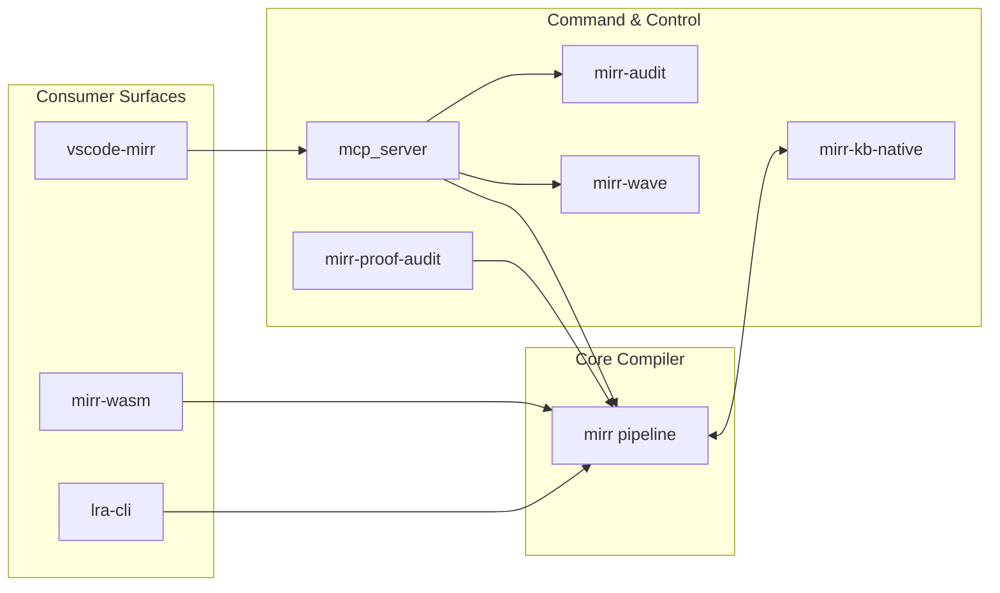

# MIRR Project Architecture & Directory Topology

Date: 2026-05-17

This document provides a comprehensive map of the repository, detailing the structural layout, data flow pathways, and architectural components of the MIRR compiler platform.

> [!IMPORTANT]
> **MAINTENANCE MANDATE**: This file is the single source of truth for the repository's topology. Under the project's zero-debt policy, whenever a new module, crate, or major architectural flow is added, moved, or removed, **you must immediately update this document** to reflect the new state. Outdated architecture mapping is strictly forbidden.

## 1. Directory Map

A clear tree breakdown explaining the directory structure of the repository:

```text
mirr-private/
├── src/                      # Core Compiler Pipeline
│   ├── ast/                  # Abstract Syntax Tree definitions
│   ├── parser/               # Front-end parsing (Lexer & Parser)
│   ├── expand/               # Compile-time pattern expansion & macro engine
│   ├── ecs/                  # Entity Component System (ECS) architecture (Registry)
│   ├── cert/                 # MEGA-4 Proof certificate format & MEGA-16 PCC verifier
│   ├── typeck/               # Type checking & constraint validation
│   ├── width/                # Width constraint solving (SCC paths)
│   ├── sat/                  # Bounded DPLL SAT solver & SmaRTLy logic simplifier
│   ├── temporal/             # Temporal lowering of hardware guards
│   ├── symbolic/             # Hardware-preparatory symbolic evaluation engine
│   ├── sexpr/                # S-expression intermediate representation (MEGA-2)
│   ├── mape_k/               # MAPE-K software simulation loop & LTL checkers
│   ├── emit/                 # Emission backends (SystemVerilog, FIRRTL, R-SPU, etc.)
│   ├── bin/                  # Executable entrypoints (mirr-compile, mirr-general, etc.)
│   └── lib.rs                # Public module exports
├── crates/                   # Consumer & Control Plane Surfaces
│   ├── mirr-wasm/            # WASM compilation API (browser/JS consumers)
│   ├── mirr-arsenal-wasm/    # Validation and compile-contract wrapper
│   ├── lra-cli/              # Living Research Artifact CLI tooling
│   ├── mirr-kb-native/       # Knowledge Base native engine (RAG / Vector search)
│   └── mirr-mcp-control-plane/ # Model Context Protocol bridge & governance
├── tests/                    # Integration & Parity Test Matrix
├── fuzz/                     # Fuzzing harnesses for robustness
├── proofs/                   # Formal verification (Coq/Rocq)
├── docs/                     # Documentation and Architecture definitions
├── proposals/                # Architectural proposals and RFCs
├── rspu_chip/                # Primary hardware project (16-core R-SPU processor)
├── stdlib/                   # Standard library definitions
└── compiler_mirr/            # Self-hosting bootstrap implementation
```

## 2. One-Screen Mental Model

MIRR is a safety-critical compiler platform with three kinds of surfaces:

1. **Core compiler**: Parse -> Validate/Expand -> Type/Width -> Temporal Lowering -> Emit.
2. **Control planes**: MRT / Presidential Arsenal, KB-lite, and private campaign planning.
3. **Consumers and bridges**: WASM, LRA, MCP, VS Code, paper/demos, proofs, fuzz, and CI scripts.

**Inputs:**
- MIRR language (Signal/Guard/Reflex + properties/patterns)

**Outputs:**
- SystemVerilog, FIRRTL, JSON netlist, DOT graphs, S-expression IR, R-SPU assembly/binary, Yosys-compatible netlists

## 3. Data Flow Pathways

The following statements describe how services and subsystems interact within the MIRR ecosystem:

1. **Compiler Pipeline Flow:** 
   - Source code is ingested by the [Lexer/Parser](../src/parser/module_parser/mod.rs), generating an AST.
   - The AST is hydrated into the [ECS Registry](../src/ecs/registry.rs), where all hardware declarations become entities.
   - [Semantic Validation](../src/ecs/semantic_validate.rs) ensures entity integrity (Name and Kind constraints).
   - [Width Solver](../src/width/solver.rs) infers missing signal widths using SCC propagation. Note: The ECS-native width inference system is currently a mock; the AST-based solver remains the primary engine.
   - [Temporal Lowering](../src/temporal/mod.rs) translates hardware guards into deterministic netlist primitives.
 This pass is fully ECS-native (Phase 3 transition complete), using the ECS Registry as the primary source of truth. It synthesizes `TemporalNodeComponent` metadata for each guard entity, closing the "Temporal Seam".
   - [Symbolic Evaluation Engine](../src/symbolic/mod.rs) provides abstract interpretation, discrete calculus approximations, anomaly signature fingerprinting, and a term rewriting engine for runtime logic optimization.
   - Finally, [Emission Backends](../src/emit/mod.rs) generate the target artifacts.

2. **Control Plane & RAG Integration:**
   - The [MCP Semantic Bridge](../crates/mirr-mcp-control-plane/) routes cross-subsystem tool calls.
   - The [Knowledge Base Engine](../crates/mirr-kb-native/) serves as a RAG vector store. The compiler queries `mirr-kb-native` for synthesis precedents and formal proofs before resolving complex guard patterns.

3. **Consumer Facades:**
   - The [mirr-wasm](../crates/mirr-wasm/) crate provides a JS-compatible binding over the core compiler, enabling browser-based IDEs and demonstrations.
   - The [lra-cli](../crates/lra-cli/) interacts with the Arsenal tooling for markdown/HTML validation and receipt signing.

4. **Yosys-to-MIRR Roundtrip Parity Validation Pipeline:**
   - Arbitrary input Verilog/RTL is synthesized using Yosys into a technology-mapped JSON netlist.
   - The [MIRR Hydrator](../src/bin/mirr-hydrate.rs) ingests this JSON and maps the cells directly back into MIRR signals and reflexes.
   - The compiled MIRR output is then lower-synthesized again via Yosys and formally verified using SAT Equivalence Checking (`equiv`) to guarantee absolute codegen parity and correct optimization.

## 4. Architectural Component Graphs

### Core Pipeline Architecture


### Ecosystem Integration Map



## 4.5 Formal Proofs Topology (proofs/)

The repository maintains rigorous formal verification infrastructure in the `proofs/` directory:

- **`proofs/compiler/`**: Coq/Rocq verification of AST simplification passes.
  - `ConstFold.v`: Proves semantic preservation of constant folding on arithmetic expressions.
  - `Simplify.v`: Equivalence proofs for logic simplification rules.
- **`proofs/cert/`**: Formal specification and totality proofs of Proof-Carrying Code (PCC) boundary conditions.
  - `Verifier.v`: Axiomatizes safety invariants for dynamic hardware and software bounds.
- **`proofs/mape_k/`**: Proves behavioral equivalence of software and hardware control loops.
  - `Equivalence.v`: Relates abstract software MAPE-K logic to the synthesized gate-level representations.
- **`proofs/language/`**: Core MIRR language semantics and type soundness proofs.
- **`proofs/rspu/`**: R-SPU ISA instruction set encoding bijectivity and behavioral proofs.
- **`proofs/width/`**: FIRWINE width inference uniqueness and optimality theorems.
- **Tooling (`src/bin/mirr-proof-audit.rs`)**:
  - Automatically maps and audits Rocq proof coverage against compiled AST nodes, reporting proof densities and gaps for formal CI gates.

## 4.6 R-SPU 16-Core Architecture (rspu_chip/)

The `rspu_chip/` directory houses the complete structural hardware layout of the R-SPU processor:

- **64-bit Tagged-Word Specification (`core/types.mirr`)**:
  - Encodes the standard 64-bit word format: `[63:40]` Reserved (24 bits), `[39:36]` Provenance tracking (4 bits), `[35:32]` Hardware Type Tag (4 bits), and `[31:0]` Raw Data Payload (32 bits).
- **Core Subsystems**:
  - `core/alu.mirr`: High-assurance ALU performing hardware type dispatch and dynamic arithmetic safety trap generation.
  - `core/regfile.mirr`: Bounded register file (256x64-bit tagged words) with concurrent dual read and single write lines.
  - `core/pipeline.mirr`: Bounded 5-stage pipeline wiring together Fetch (IF), Decode (ID), Execute (EX), Memory (MEM), and Writeback (WB) stages.
  - `core/core_top.mirr`: Top-level core wrapper integrating pipeline stages and exception routing.
- **Verification Subsystems**:
  - `verification/pcc_verifier.mirr`: Safe IF-stage hardware gatekeeper enforcing dynamic verification bounds and instruction boundaries.
  - `verification/tmr_voter.mirr`: Triple-Modular Redundancy (TMR) majority voter mask to mitigate single-core physical faults.
- **Interconnect & Fabric**:
  - `interconnect/noc_router.mirr`: 16-port packet-switched Network-on-Chip (NoC) router supporting broadcast/star topology routing.
  - `rspu_top.mirr`: Top-level integration file wiring the 16 cores to the NoC router and verification voters.

## 5. Main Projects At A Glance

### Core Layer

| Project | What it is | Architecture overview | Current phase/status |
|---|---|---|---|
| [`src`](../src) / core compiler | The compiler engine | Front-end -> semantic validation -> type/width solving -> temporal lowering -> emit backends | Phases 0-7h complete; 7i+ in progress |
| [`src/bin/mirr-hydrate.rs`](../src/bin/mirr-hydrate.rs) | MIRR Hydrator | Converts Yosys JSON technology-mapped netlists to structured MIRR files | Core component; complete and verified |
| [`src/bin/mirr-proof-audit.rs`](../src/bin/mirr-proof-audit.rs) | Proof Auditor | Audits coverage of formal proofs across compiler AST and emission nodes | Phase 7i tool; initialized |
| [`compiler_mirr`](../compiler_mirr) | Self-hosting compiler subset | MIRR-written bootstrap implementation | Stage-1 hosted self-hosting, in progress |

### Control Plane Layer

| Project | What it is | Architecture overview | Current phase/status |
|---|---|---|---|
| `MRT / Presidential Arsenal` | The command/control plane | `mirr-audit`, `mirr-brain`, `mirr-wave`, `mirr-general`, `mirr-lsp`; KB-lite local governance via `mcp_server` | Shared governance/roadmap layer |

### Consumer / Bridge Layer

| Project | What it is | Architecture overview | Current phase/status |
|---|---|---|---|
| [`crates/mirr-wasm`](../crates/mirr-wasm) | Browser/WASM compiler API | wasm-bindgen facade over `run_pipeline` | Consumer surface; parity-gated |
| [`crates/mirr-arsenal-wasm`](../crates/mirr-arsenal-wasm) | Arsenal/RWFI2 contract bridge | WASM validation wrapper over core compiler | Consumer surface; parity-gated |
| [`crates/lra-cli`](../crates/lra-cli) | Living Research Artifact CLI | Arsenal-facing CLI for local serving & validation | Arsenal-facing CLI surface |
| [`crates/mirr-mcp-control-plane`](../crates/mirr-mcp-control-plane) | MRT MCP bridge | Stdio MCP bridge dispatching to `mirr-*` CLI | Bridge surface; contract-tested |

## 6. First 90 Minutes: Repository Onboarding Sequence

1. **Read Product & Constraints:**
   - [`README.md`](../README.md)
   - [`GEMINI.md`](../GEMINI.md)

2. **Read Compiler API Surface:**
   - [`src/lib.rs`](../src/lib.rs)

3. **Read Entrypoint Binaries:**
   - [`src/bin/mirr-compile/main.rs`](../src/bin/mirr-compile/main.rs)
   - [`src/bin/mirr-general/main.rs`](../src/bin/mirr-general/main.rs)

4. **Run Confidence Gate:**
   - `./target/debug/mirr-general ci --format json`

## 7. Roadmap Crosswalk

| Phase | Status | What it is |
|---|---|---|
| Phase 0 - 4 | Complete | Foundation through Width inference |
| Phase 5 | Complete | MAPE-K simulation harness |
| Phase 6 | Complete | Integration and visualization |
| Phase 7a-d | Complete | Safety properties, pattern system, advanced types, S-expression IR |
| Phase 7e | Complete | Hardened Temporal Simulator (Double-buffered, Cycle-accurate, Prev) |
| Phase 7f | Complete    | Proof-carrying code (PCC) infrastructure |
| Phase 7g | Complete    | Symbolic evaluation engine (Intervals, Fingerprints) |
| Phase 7h | Complete    | MAPE-K hardware realization (SV emitter & verification) |

| Phase 7i | In Progress | Verified compilation chain (ConstFold proof & audit tool) |
| Phase 8a | In Progress | R-SPU Core Architecture (64-bit tagged-word pipeline) |

## 8. Practical Pitfalls In This Workspace

- **Environment Note:** `cargo run --bin <name> -- <args>` is broken in this environment due to a rustup home-dir error. Always invoke compiled binaries directly (`./target/debug/<name>`).
- Do not trust stale status docs/logs over source and tests.
- Self-hosting is active but still evolving; parity tests are a better truth source than narrative status files.
