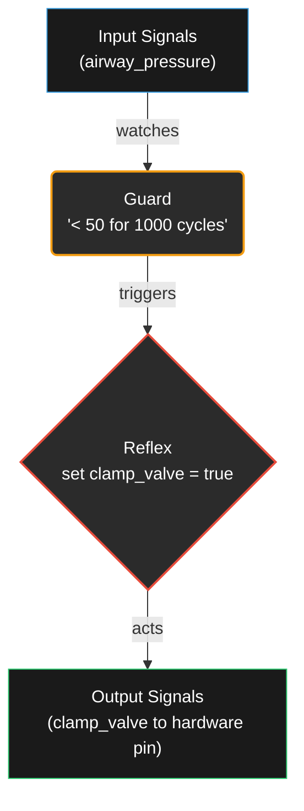
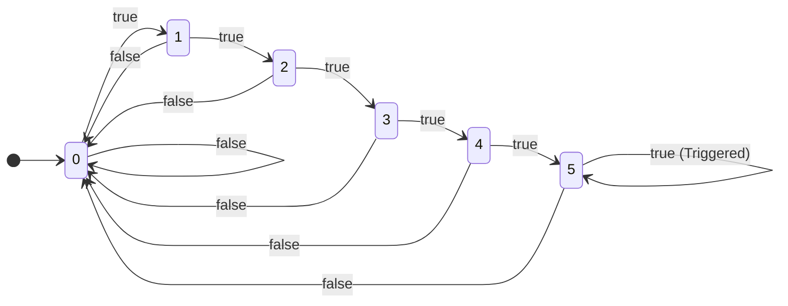

# Tutorial: MIRR from Scratch

A step-by-step guide for absolute beginners. No prior hardware experience
required. You just need to be able to read code.

---

## Table of Contents

1. [What is hardware and why it matters](#lesson-1-what-is-hardware-and-why-it-matters)
2. [The three building blocks](#lesson-2-the-three-building-blocks)
3. [Your first MIRR program](#lesson-3-your-first-mirr-program)
4. [Types and expressions](#lesson-4-types-and-expressions)
5. [Temporal guards](#lesson-5-temporal-guards)
6. [Properties](#lesson-6-properties)
7. [Patterns](#lesson-7-patterns)
8. [Reading compiler output](#lesson-8-reading-compiler-output)
9. [Common errors](#lesson-9-common-errors)
10. [What MIRR does NOT do](#lesson-10-what-mirr-does-not-do)

---

## Lesson 1: What is hardware and why it matters

### Software vs. hardware

When you write a program in Python, JavaScript, or Rust, it runs as
**software**. The computer's processor reads your instructions one at a
time and executes them in order. If the processor is busy doing something
else, your code waits.

**Hardware** is different. Hardware is a physical circuit etched onto a
chip. It does not "run" in the software sense — it reacts. When an
electrical signal arrives, the circuit responds immediately, in the same
way every time. There is no operating system, no scheduler, no queue.

### Why does this matter?

Consider a ventilator keeping a newborn alive. If the air pressure drops
dangerously, the machine must clamp a valve shut — not in 50 milliseconds
when the operating system gets around to it, but within a single clock
cycle (typically 10 nanoseconds).

Software can be fast, but it cannot guarantee timing. Hardware can.

> [!IMPORTANT]
> In safety-critical systems, timing is not a performance metric -- it is a correctness requirement. A response that arrives 1 millisecond late in a neonatal ventilator is not slow; it is wrong.

### What is a clock cycle?

A hardware chip has a **clock** — a tiny oscillator that ticks at a fixed
rate. Every tick is one **clock cycle**. At each tick, every circuit on
the chip reads its inputs and updates its outputs simultaneously.

Think of it like a metronome: on every beat, the entire orchestra plays
the next note together. Nothing runs "out of order."

A common clock speed is 100 MHz — that is 100 million ticks per second.
One tick lasts 10 nanoseconds.

### What is MIRR?

MIRR is a language that lets you describe hardware rules in plain code.
You write what you want the hardware to do. The MIRR compiler translates
your code into a hardware description that can be manufactured onto a
chip.

MIRR is not a general-purpose programming language. It has no loops, no
functions, no if-else, no heap. It does exactly one thing: it lets you
write safety rules that become physical circuits with **Zero-Jitter** guarantees.

### Key terms

| Term | Plain-English definition |
|------|--------------------------|
| **Hardware** | A physical circuit on a chip. Reacts instantly, every clock cycle. |
| **Software** | Instructions read and executed by a processor, one at a time. |
| **Clock cycle** | One tick of the hardware clock. Everything updates simultaneously. |
| **HDL** | Hardware Description Language — a language for describing circuits. MIRR is one. |
| **RTL** | Register-Transfer Level — the level of detail at which hardware is described. It specifies how data moves between storage elements (registers) each cycle. |
| **Synthesis** | The process of converting an HDL description into actual gates and wires on a chip. |

---

## Lesson 2: The three building blocks

MIRR is built on exactly three concepts. Every MIRR program uses only
these three:

```mirr
Signal  -  a wire carrying data
Guard   -  a condition that watches signals over time
Reflex  -  an action that fires when a guard triggers
```

That is the entire language. There are no other constructs for hardware
generation. (Properties and patterns exist, but they do not generate
hardware — more on that in Lessons 6 and 7.)

### Signals: the wires

A signal is a named wire that carries a value every clock cycle. Signals
have a direction and a type.

Think of signals like pipes in a plumbing system. Some pipes bring water
in (`in`), some carry water out (`out`), and some are internal connections
you cannot see from outside.

```mirr
signals {
    airway_pressure: in u16    // a 16-bit number coming in
    clamp_valve:     out bool  // a true/false value going out
}
```

### Guards: the watchers

A guard watches one or more signals and checks a condition over time.
It does not do anything by itself — it just observes and decides
"yes, this condition has been met."

Think of a guard like a smoke detector. It constantly monitors the air.
When it detects smoke persisting for a certain duration, it triggers.
But the detector itself does not spray water — that is someone else's
job.

```mirr
guard sustained_pressure_drop {
    when airway_pressure < 50
    for 1000 cycles;
}
```

This guard watches the `airway_pressure` signal. If the pressure stays
below 50 for 1000 consecutive clock cycles, the guard triggers.

### Reflexes: the responders

A reflex listens to a guard and takes an action when the guard triggers.
It is the only way to change an output signal.

Think of a reflex like the sprinkler system connected to the smoke
detector. When the detector triggers, the sprinkler activates.

```mirr
reflex emergency_clamp {
    on sustained_pressure_drop {
        clamp_valve = true;
    }
}
```

When `sustained_pressure_drop` triggers, this reflex sets `clamp_valve`
to `true`.

### How they connect



### The module wrapper

Every MIRR program lives inside a `module`. A module is like a chip
boundary — it declares what signals go in, what signals come out, and
what logic runs inside.

```mirr
module neonatal_respirator {
    // signals, guards, and reflexes go here
}
```

---

## Lesson 3: Your first MIRR program

> [!TIP]
> If you remember only one thing from Lesson 2: **Signal** is data,
> **Guard** is a condition over time, **Reflex** is the action. Everything
> else in MIRR exists to support these three.

Let us write a complete MIRR program step by step: a neonatal respirator
safety monitor.

### The scenario

A ventilator for newborns has an air pressure sensor. If the pressure
drops below 50 (arbitrary units) and stays low for 1000 clock cycles,
we want to engage an emergency clamp valve.

> [!TIP]
> In this example, we use the ergonomic `signals { ... }` block to declare multiple signals. You can also declare them individually: `signal airway_pressure: in u16;`.

### Step 1: Create the file

Create a file called `my_respirator.mirr` with the following content:

```mirr
module neonatal_respirator {
    signals {
        respirator_enable: in bool
        airway_pressure:   in u16
        clamp_valve:       out bool
    }

    guard sustained_pressure_drop {
        when airway_pressure < 50
        for  1000 cycles;
    }

    reflex emergency_clamp {
        on sustained_pressure_drop {
            clamp_valve = true;
        }
    }
}
```

Let us read it line by line:

1. `module neonatal_respirator { ... }` — declares a module named
   `neonatal_respirator`.
2. Three signals:
   - `respirator_enable` — a boolean input (is the machine on?).
   - `airway_pressure` — a 16-bit unsigned integer input (sensor reading).
   - `clamp_valve` — a boolean output (the valve we control).
3. One guard: `sustained_pressure_drop` watches `airway_pressure < 50`
   and waits for it to persist for 1000 consecutive cycles.
4. One reflex: `emergency_clamp` fires when the guard triggers and sets
   `clamp_valve = true`.

### Step 2: Compile it

```bash
cargo run --bin mirr-compile -- --emit verilog my_respirator.mirr
```

This tells the MIRR compiler to:
- Read `my_respirator.mirr`
- Run it through all compiler stages (parse, validate, expand patterns,
  type check, simplify, width inference, temporal lowering)
- Emit a Verilog file (Verilog is a standard hardware description language
  that chip manufacturers understand)

If everything is correct, you will see Verilog code printed to the
terminal. This Verilog can be fed to a synthesis tool to manufacture a
real chip.

### Step 3: Try other output formats

```bash
# SystemVerilog Assertions — formal verification checks
cargo run --bin mirr-compile -- --emit sva my_respirator.mirr

# JSON — machine-readable output for tools
cargo run --bin mirr-compile -- --emit json my_respirator.mirr

# DOT — graph visualization (open with Graphviz)
cargo run --bin mirr-compile -- --emit dot my_respirator.mirr

# FIRRTL — intermediate representation for the FIRRTL ecosystem
cargo run --bin mirr-compile -- --emit firrtl my_respirator.mirr
```

---

## Lesson 4: Types and expressions

### Types

MIRR has a small, fixed set of types:

| Type | What it holds | Size |
|------|---------------|------|
| `bool` | `true` or `false` | 1 bit |
| `u8` | Unsigned integer 0-255 | 8 bits |
| `u16` | Unsigned integer 0-65535 | 16 bits |
| `u32` | Unsigned integer 0-4294967295 | 32 bits |
| `u64` | Unsigned integer 0-18446744073709551615 | 64 bits |
| `i8` | Signed integer -128 to 127 | 8 bits |
| `i16` | Signed integer -32768 to 32767 | 16 bits |
| `i32` | Signed integer -2147483648 to 2147483647 | 32 bits |
| `i64` | Signed integer | 64 bits |

There are no floating point numbers, no strings, no
arrays, no structs. Hardware operates on bits and fixed-width numbers.

**Signed vs. unsigned:** Use unsigned types (`u8`–`u64`) for sensor readings,
counters, and addresses. Use signed types (`i8`–`i64`) for values that can be
negative, such as temperature deltas or error signals. The compiler rejects
mixed signed/unsigned operations — you must be explicit about which you mean.

### Comparison operators

You use these to compare signal values:

| Operator | Meaning | Example |
|----------|---------|---------|
| `<` | Less than | `pressure < 50` |
| `<=` | Less than or equal | `pressure <= 50` |
| `>` | Greater than | `temperature > 100` |
| `>=` | Greater than or equal | `temperature >= 100` |
| `==` | Equal | `enable == true` |
| `!=` | Not equal | `mode != 0` |

### Logical operators

Combine conditions:

| Operator | Meaning | Example |
|----------|---------|---------|
| `&&` | AND — both must be true | `a > 10 && b < 5` |
| `\|\|` | OR — either can be true | `a > 10 \|\| b < 5` |
| `!` | NOT — inverts true/false | `!enable` |
| `^` | XOR — exactly one is true | `a ^ b` |

### Arithmetic operators

| Operator | Meaning | Example |
|----------|---------|---------|
| `+` | Add | `a + b` |
| `-` | Subtract | `a - b` |
| `*` | Multiply | `a * b` |
| `<<` | Shift left | `a << 2` |
| `>>` | Shift right | `a >> 1` |
| `-` (unary) | Negate (signed) | `-a` |

### The `prev()` function

`prev()` lets you look at a signal's value from a previous clock cycle.

```mirr
prev(airway_pressure, 1)   // the value of airway_pressure one cycle ago
prev(airway_pressure, 3)   // the value three cycles ago
```

Think of `prev()` as a "memory window." The hardware remembers what the
signal was N cycles ago and lets you compare it to the current value.

The delay must be at least 1. `prev(signal, 0)` is an error — that is
just the current value, and the compiler will reject it.

### Truth table: AND, OR, NOT

For reference, here is how the logical operators work on boolean values:

```
AND (&&):           OR (||):            NOT (!):
  A     B   Result    A     B   Result    A   Result
  false false false    false false false    false true
  false true  false    false true  true     true  false
  true  false false    true  false true
  true  true  true     true  true  true
```

---

## Lesson 5: Temporal guards

### What "temporal" means

In MIRR, "temporal" means "over time." A temporal guard does not just
check a condition at one instant — it checks whether the condition holds
for a specified duration.

### The `for N cycles` clause

Every guard has two parts:

1. **`when <condition>`** — what to watch for
2. **`for N cycles`** — how long it must persist

```mirr
guard overheating {
    when temperature > 100
    for 5 cycles;
}
```

This guard says: "if `temperature` stays above 100 for 5 consecutive
clock cycles, trigger."

If the temperature goes above 100 for 4 cycles and then drops, the
guard does NOT trigger. The counter resets and starts over.

### How it works inside the chip

The compiler turns each guard into a **counter circuit** (state machine):




The counter increments each cycle the condition is true. If the condition
becomes false, the counter resets to 0. The guard triggers only when the
counter reaches N.

### Using `prev()` in guards

You can use `prev()` in guard conditions to detect changes:

```mirr
guard pressure_spike {
    when airway_pressure > prev(airway_pressure, 1) + 20
    for 1 cycles;
}
```

This detects when the pressure jumps by more than 20 in a single cycle.

---

## Lesson 6: Properties

### What properties do

Properties are **verification rules**. They describe what MUST or MUST NOT
be true about your hardware. The compiler checks them but they do NOT
generate hardware — they produce assertions that formal verification
tools can prove or disprove.

Think of properties like a contract: "I declare that my hardware must
always satisfy these conditions." A separate tool (a formal verifier)
reads these assertions and mathematically proves whether they hold.

### The three property formulas (basic)

```mirr
property pressure_bounded {
    always (airway_pressure > 10);
}
```

`always (P)` means: "P must be true on every single clock cycle."

```mirr
property no_spurious_clamp {
    never (clamp_valve && airway_pressure > 200);
}
```

`never (P)` means: "P must never be true on any clock cycle." This is
equivalent to `always (!P)` but reads more naturally.

```mirr
property low_triggers_clamp {
    always (airway_pressure < 50 -> clamp_valve);
}
```

`always (P -> Q)` means: "whenever P is true, Q must also be true (in
the same cycle)." The `->` is called **implication**. It says "P implies
Q."

### The three property formulas (advanced)

```mirr
property never_drop_implies_alarm {
    never (airway_pressure < 30 -> !clamp_valve);
}
```

`never (P -> Q)` means: "it must never be the case that P implies Q."

```mirr
property clamp_reachable {
    cover eventually within 100 (clamp_valve);
}
```

`eventually within N (P)` means: "P must become true at least once within
N clock cycles from reset." This is used to prove that something CAN
happen — that a state is reachable.

```mirr
property clamp_follows_drop {
    always (airway_pressure < 50 followed_by 5 clamp_valve);
}
```

`always (P followed_by N Q)` means: "whenever P is true, Q must be true
exactly N cycles later."

### Directives: assert, cover, assume

Each property has a **directive** that tells the formal verifier what to
do with it:

| Directive | Meaning | When to use |
|-----------|---------|-------------|
| (none / default) | `assert` — prove this holds | Normal safety assertions |
| `cover` | Prove this is reachable | Check that a state can be reached |
| `assume` | Assume this is true (constrain inputs) | Restrict the verifier's input space |

Example with explicit directive:

```mirr
property clamp_reachable {
    cover eventually within 100 (clamp_valve);
}
```

The `cover` directive tells the verifier: "I am not asking you to prove
this always holds. I am asking you to prove that there exists at least one
scenario where `clamp_valve` becomes true within 100 cycles."

### Properties do NOT generate hardware

> [!WARNING]
> Properties produce verification assertions, not hardware. A property like
> `always (pressure > 10)` does not create a circuit that enforces the
> condition. Only reflexes drive hardware outputs.

This is important. A property like `always (pressure > 10)` does NOT
create a circuit that enforces `pressure > 10`. It creates a check that
a formal verification tool can analyze. The hardware behavior is defined
entirely by signals, guards, and reflexes.

---

## Lesson 7: Patterns

### The problem patterns solve

Imagine you have 10 sensors that all need the same guard-and-reflex
structure: "if sensor exceeds a limit for N cycles, set an alarm." Writing
the same code 10 times is tedious and error-prone.

Patterns let you define a reusable template once and use it many times
with different parameters.

### Defining a pattern with `def` and `reflect`

```mirr
def threshold_guard(
    sensor: signal in u16,
    limit:  u16,
    delay:  u32,
    alarm:  signal out bool
) {
    reflect {
        guard ${sensor}_over {
            when ${sensor} > ${limit}
            for  ${delay} cycles;
        }

        reflex ${sensor}_trigger {
            on ${sensor}_over {
                ${alarm} = true;
            }
        }

        property ${sensor}_safety {
            always (${sensor} > ${limit} -> ${alarm});
        }
    }
}
```

Breaking it down:

- `def` declares a named pattern.
- Parameters are listed in parentheses. Each one has a name and a type.
  - `signal in u16` means "a signal that carries a 16-bit input"
  - `u16` means "a plain 16-bit value" (not a signal, just a number)
  - `signal out bool` means "a signal that carries a boolean output"
- `reflect { ... }` contains the template body.
- `${param}` substitutes the parameter's value into names and expressions.

### Using a pattern

Inside a module, call the pattern like a function:

```mirr
module dual_sensor {
    signals {
        temperature:    in  u16
        pressure:       in  u16
        temp_alarm:     out bool
        pressure_alarm: out bool
    }

    calls {
        threshold_guard(temperature, 100, 5, temp_alarm)
        threshold_guard(pressure, 300, 3, pressure_alarm)
    }
}
```

The compiler expands each call into the full guard/reflex/property code,
with unique names so nothing collides:

- First call produces: `threshold_guard_0_temperature_over`,
  `threshold_guard_0_temperature_trigger`, etc.
- Second call produces: `threshold_guard_1_pressure_over`,
  `threshold_guard_1_pressure_trigger`, etc.

### When to use patterns

Use patterns when you have the same signal/guard/reflex structure repeated
for different signals or thresholds. Do not use patterns for one-off logic.

---

## Lesson 8: Reading compiler output

The MIRR compiler can emit ten output formats. Each serves a different
purpose.

````carousel
### Verilog (`--emit verilog`)

Verilog is the standard hardware description language used by chip
manufacturers. This is the primary output — it is what gets turned into
a real chip.

**Who reads it:** Hardware engineers, synthesis tools (Xilinx Vivado,
Intel Quartus, Synopsys Design Compiler).

```bash
cargo run --bin mirr-compile -- --emit verilog examples/neonatal_respirator.mirr
```
<!-- slide -->
### FIRRTL (`--emit firrtl`)

FIRRTL (Flexible Intermediate Representation for Register-Transfer Level)
is an intermediate format used by the FIRRTL compiler framework
(originally from UC Berkeley's Chisel project).

**Who reads it:** FIRRTL-based toolchains for further hardware
transformations.

```bash
cargo run --bin mirr-compile -- --emit firrtl examples/neonatal_respirator.mirr
```
<!-- slide -->
### R-SPU Assembly (`--emit rspu`)

R-SPU (Reflex Signal Processing Unit) is MIRR's instruction-level backend.
It compiles your module into a bounded instruction sequence for a
safety-critical processor architecture.

**Who uses it:** Embedded safety systems, custom silicon targets, MAPE-K
runtime monitors.

```bash
cargo run --bin mirr-compile -- --emit rspu examples/neonatal_respirator.mirr
```
<!-- slide -->
### DOT (`--emit dot`)

DOT is a graph description language used by Graphviz. The output is a
visual diagram showing how signals, guards, and reflexes connect.

**Who reads it:** You, for debugging and understanding your design.

```bash
cargo run --bin mirr-compile -- --emit dot examples/neonatal_respirator.mirr
# Then open the .dot file with Graphviz or an online viewer
```
<!-- slide -->
### JSON (`--emit json`)

A machine-readable representation of the compiled program. Useful for
building tools on top of the MIRR compiler.

**Who reads it:** Scripts, dashboards, other programs that need to
analyze the compiled output.

The JSON output includes:
- `schema_version` — version of the JSON schema (currently `"0.2.0"`)
- `ir_version` — version of the IR contract (currently `"1.0"`)
- `program` — the full ECS entity graph of your module
- `simplify_stats` — how many logic simplifications were applied
- `width_stats` — bit-width inference results
- `temporal` — the lowered temporal guard netlist
- `properties` — your property declarations

```bash
cargo run --bin mirr-compile -- --emit json examples/neonatal_respirator.mirr
```
<!-- slide -->
### Testbench (`--emit testbench`)

Generates a SystemVerilog testbench that instantiates the compiled module
and drives stimulus for basic smoke-testing.

**Who reads it:** Hardware engineers running simulation in Vivado, Quartus,
or open-source simulators like Verilator.

```bash
cargo run --bin mirr-compile -- --emit testbench examples/neonatal_respirator.mirr
```
<!-- slide -->
### S-expression IR (`--emit sexpr`)

Emits the compiled design as an S-expression intermediate representation.
Useful for tool interop, custom analysis passes, and round-trip testing.

**Who reads it:** Toolchain developers, custom analysis scripts, the
MIRR S-expression evaluator.

```bash
cargo run --bin mirr-compile -- --emit sexpr examples/neonatal_respirator.mirr
```
<!-- slide -->
### FPGA Scaffold (`--emit fpga_scaffold`)

Generates a complete FPGA project scaffold including pin constraints,
clock configuration, and top-level wrappers for supported FPGA targets.

**Who reads it:** FPGA engineers targeting Xilinx, Lattice, or Intel
development boards.

```bash
cargo run --bin mirr-compile -- --emit fpga_scaffold examples/neonatal_respirator.mirr
```
<!-- slide -->
### Build Script (`--emit build_script`)

Generates a Makefile or build script that invokes the appropriate
synthesis toolchain for the selected target.

**Who reads it:** CI pipelines, build systems, hardware engineers
automating synthesis flows.

```bash
cargo run --bin mirr-compile -- --emit build_script examples/neonatal_respirator.mirr
```
<!-- slide -->
### DSP (`--emit dsp`)

Emits a DSP (Digital Signal Processing) block description for modules
that use arithmetic-heavy signal chains, targeting dedicated DSP slices
on FPGAs.

**Who reads it:** DSP engineers, FPGA synthesis tools that map to
hardware multiplier/accumulator blocks.

```bash
cargo run --bin mirr-compile -- --emit dsp examples/neonatal_respirator.mirr
```
````


---

## Lesson 9: Common errors

When the MIRR compiler finds a problem, it tells you with a structured
error message. Each error has a code prefix that tells you what category
the problem belongs to.

### Error code categories

| Code | Category | What went wrong |
|------|----------|-----------------|
| `[E1xx]` | Parse error | The compiler could not understand the syntax of your code (E101–E166, E170–E181) |
| `[E2xx]` | Semantic error | The syntax is valid but the meaning is wrong (E201–E216) |
| `[E300]` | Temporal error | Something went wrong during temporal guard compilation |
| `[E4xx]` | Pattern error | Something went wrong during pattern expansion (E400–E425) |
| `[E5xx]` | Width error | Bit-width inference found an inconsistency (E500–E511) |
| `[E6xx]` | Type error | Type checker found a type mismatch (E601–E609) |
| `[E7xx]` | R-SPU error | R-SPU instruction emission failed (E701–E715) |
| `[E8xx]` | S-expression error | S-expression IR processing failed (E800–E815) |

### [E1xx] Parse errors

**Unbalanced parentheses:**

```diff
- guard g {
-     when (pressure < 50
-     for 1 cycles;
- }
+ guard g {
+     when (pressure < 50)
+     for 1 cycles;
+ }
```

```
[E100] Parse error: [E171] Unbalanced parentheses in expression.
```

**Fix:** Add the missing closing parenthesis: `when (pressure < 50)`.

**Too many tokens:**

```diff
- signals {
-     x: in out bool
- }
+ signals {
+     x: in bool
+ }
```

```
[E100] Parse error: [E114] Too many tokens in signal declaration.
```

**Fix:** A signal is either `in` or `out`, not both.

### [E2xx] Semantic errors

**Duplicate names:**

```diff
  signals {
-     x: in bool
-     x: out bool   // x declared twice
+     x_in: in bool
+     x_out: out bool
  }
```

```
Semantic error: [E201] Duplicate signal name: 'x'. First defined at line 2.
```

**Fix:** Give each signal a unique name.

**Undeclared signal reference:**

```diff
  guard g {
-     when ghost > 50      // 'ghost' is not declared
+     when host > 50
      for 1 cycles;
  }
```

```
Semantic error: [E204] Guard 'g' references undeclared signal 'ghost'. Did you mean 'host'?
```

**Fix:** Declare `ghost` as a signal, or correct the spelling. The compiler
suggests the closest match when a similar name exists.

**Invalid `prev()` delay:**

```mirr
property p {
    always (prev(sensor, 0) > 50);   // delay 0 is invalid
}
```

```
Semantic error: [E209] 'p' contains prev('sensor') with delay 0; delay must be >= 1.
```

**Fix:** Use `prev(sensor, 1)` or higher.

### [E300] Temporal errors

These occur during the temporal lowering stage (when the compiler converts
guards into counter circuits). They are rare in normal usage.

### [E4xx] Pattern errors

**Undefined pattern:**

```mirr
module m {
    signals {
        x: in u16
    }

    undefined_pattern(x)    // no such pattern exists
}
```

```
[E400] Pattern error: Undefined pattern 'undefined_pattern'.
```

**Fix:** Define the pattern with `def` before calling it, or fix the name.

---

## Lesson 10: What MIRR does NOT do

MIRR is deliberately minimal. Understanding what it cannot do is as
important as understanding what it can do.

### No loops

> [!WARNING]
> There is no `for`, `while`, or `loop`. Hardware does not "loop" — it
> exists physically and operates every cycle. If you need something to
> happen N times, you use a guard with `for N cycles`.

### No functions

> [!WARNING]
> There are no callable functions. Patterns (`def`/`reflect`) look like
> functions but they are compile-time templates — they are expanded before
> anything runs. There is no call stack.

### No conditionals

> [!NOTE]
> There is no `if`/`else`. Guards and reflexes are the MIRR equivalent of
> conditional behavior: "if this condition persists, then take this action."

### No variables

> [!IMPORTANT]
> There are no mutable variables. Signals carry values, but you cannot
> declare a local variable and change it over time. The only "state" in the
> hardware is in the guard counters and the `prev()` memory.

### No heap, no allocation

> [!CAUTION]
> There is no `malloc`, `new`, or dynamic allocation. Hardware is fixed at
> manufacturing time. You cannot create or destroy circuits at runtime.

### No recursion

> [!CAUTION]
> The compiler forbids recursion in all forms. This is a NASA/JPL Power-of-10
> safety rule: every algorithm must have a bounded execution time. Recursion
> makes execution time unpredictable.

### No floating point

> [!IMPORTANT]
> All types are integers (signed or unsigned) or booleans. Floating point arithmetic
> requires specialized hardware units and is outside MIRR's scope.

### Why so minimal?

> [!NOTE]
> MIRR follows NASA/JPL Power-of-10 coding rules: no recursion, bounded
> loops, bounded memory. Every language construct maps to hardware with
> predictable timing and resource usage. Safe power is better than raw, unstable power.

MIRR targets safety-critical systems — medical devices, flight
controllers, industrial safety monitors. In these systems, simplicity is
a feature. Every construct in the language maps directly to hardware with
predictable timing and resource usage. There are no hidden costs, no
abstractions to leak, no runtime surprises.

The core constructs (signal, guard, reflex) are sufficient to express
any bounded-time, event-driven hardware safety rule. By restricting the language to these, MIRR guarantees **Zero-Jitter** execution, while the macro system allows you to build complex DSLs on top of this safe foundation without compromising the generated hardware.

---

## What to read next

- [Error Codes](error_codes) — Full list of compiler diagnostics
- [Type System](type-system) — Signed/unsigned types and inference rules
- [R-SPU ISA Spec](rspu_isa_spec) — Instruction set architecture
- [Migration Guide](migration-guide) — Upgrading from an earlier version
- [Roadmap](roadmap) — Project phases and what comes next
